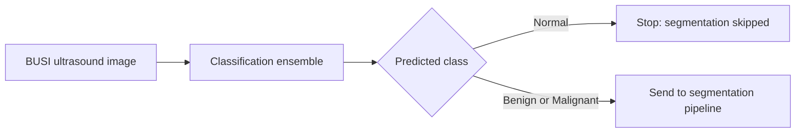
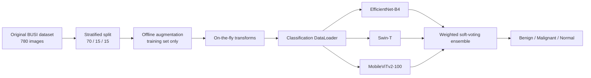
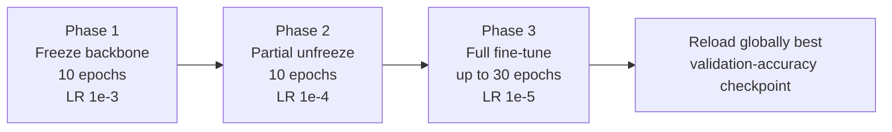
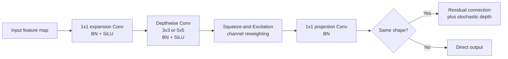
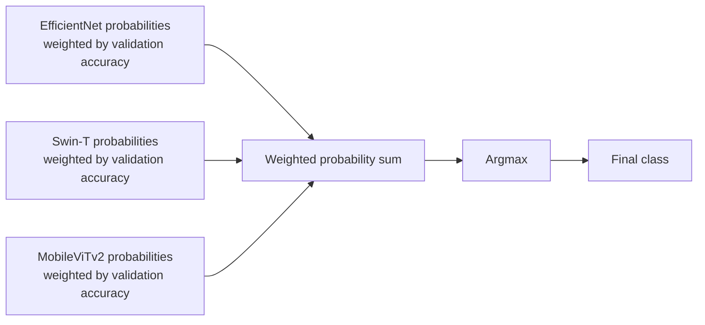

# BUSI Classification: Complete Code-Based Explanation

> **Primary source:** `BUSI_FDL_(Final_V).ipynb`  
> **Scope:** Classification only  
> **Classes:** Benign, Malignant, Normal

---

## 1. Classification Task-ta Ki?

Ei project-er classification stage-er kaj holo ekta breast ultrasound image-ke
tin-ti class-er moddhe classify kora:

| Class index | Class name |
|---:|---|
| 0 | Benign |
| 1 | Malignant |
| 2 | Normal |

Classification-er output sudhu final diagnosis-er jonno na; eta full pipeline-er
**routing/gating stage** hisebeo kaj kore:

- Prediction `normal` hole segmentation skip kora hoy.
- Prediction `benign` ba `malignant` hole image segmentation stage-e jay.



**Important code fact:** Current code-e routing decision final ensemble-er
`argmax` class diye hoy. Config-e
`CLF_ENSEMBLE_NORMAL_THRESHOLD = 0.4` define kora ache, kintu classification
ensemble ba routing logic-e threshold-ti use kora hoyni.

---

## 2. End-to-End Classification Flow



---

## 3. Dataset and Split

Original BUSI dataset:

| Class | Original images |
|---|---:|
| Benign | 437 |
| Malignant | 210 |
| Normal | 133 |
| **Total** | **780** |

Notebook-e stratified split use kora hoyeche:

- Training: 70% = 546 images
- Validation: 15% = 117 images
- Test: 15% = 117 images
- Random seed: 42

**Why stratified split?**  
Prottek split-e original class distribution approximately preserve korar jonno.
Medical classification-e kono class ekta split-e unusually kom hoye jawa
prevent korte eta important.

---

## 4. Offline Augmentation

Offline augmentation sudhu training data-te apply kora hoyeche ebong augmented
images new file hisebe save kora hoyeche.

### Transformations

- Horizontal flip, probability 0.5
- Vertical flip, probability 0.5
- Rotation from -15 to +15 degrees, probability 0.7
- Elastic transform: `alpha=50`, `sigma=5`, probability 0.3

### Class-wise augmentation

| Class | Before | Strategy | After |
|---|---:|---|---:|
| Benign | 306 | No extra offline copy | 306 |
| Malignant | 147 | One augmented copy per image | 294 |
| Normal | 93 | Two augmented copies per image | 279 |
| **Total** | **546** |  | **879** |

**Purpose:** Minority classes-ke balance kora. Ete weighted loss-er agei training
distribution onek balanced hoye jay.

---

## 5. On-the-Fly Transform

Training-er somoy prottek epoch-e DataLoader image load korar por:

1. Resize to `256 x 256`
2. Gaussian noise, variance 10-50, `p=0.3`
3. Random brightness and contrast, limit `0.2`, `p=0.3`
4. Gaussian blur, kernel 3-5, `p=0.2`
5. CLAHE, clip limit `2.0`, `p=0.3`
6. ImageNet normalization
7. Convert to PyTorch tensor

ImageNet normalization:

```text
mean = [0.485, 0.456, 0.406]
std  = [0.229, 0.224, 0.225]
```

Validation and test data-te sudhu:

- Resize to `256 x 256`
- ImageNet normalization
- Tensor conversion

Validation/test-e random augmentation na deyar karon holo evaluation-ke stable
and fair rakha.

---

## 6. Classification Dataset and DataLoader

`BUSIClassificationDataset`:

- CSV/DataFrame theke image path and label ney.
- Original and augmented image-er path alada directory theke resolve kore.
- Image-ke RGB-te convert kore.
- Label mapping kore:
  `benign=0`, `malignant=1`, `normal=2`.
- Relevant transform apply kore.
- `(image_tensor, label)` return kore.

DataLoader configuration:

| Setting | Value |
|---|---|
| Batch size | 16 |
| Train shuffle | True |
| Validation/test shuffle | False |
| Workers | 2 |
| Pin memory | True |
| Input shape | `(B, 3, 256, 256)` |
| Model output | `(B, 3)` logits |

---

## 7. Class Weights and Loss

Offline augmentation-er por class weights:

| Class | Weight |
|---|---:|
| Benign | 0.9575 |
| Malignant | 0.9966 |
| Normal | 1.0502 |

Formula:

```text
weight(class) = total training samples / (number of classes x class count)
```

Loss:

```python
nn.CrossEntropyLoss(weight=class_weights_tensor)
```

Weighted Cross Entropy minority/underrepresented class-er error-ke relatively
beshi importance dey.

Model directly probability output kore na; model **three logits** output kore.
Training-e `CrossEntropyLoss` internally suitable log-softmax operation handle
kore. Inference-e probability pawar jonno explicitly `softmax` use kora hoy.

---

## 8. Reproducibility and Device

- Python random seed: 42
- NumPy seed: 42
- PyTorch CPU/GPU seed: 42
- cuDNN deterministic: True
- cuDNN benchmark: False
- CUDA available hole GPU, otherwise CPU

Eta run-to-run variation reduce kore, although complete bit-for-bit
reproducibility environment and library version-er upor-o depend korte pare.

---

## 9. Classification Training Configuration

| Configuration | Value |
|---|---:|
| Batch size | 16 |
| Phase 1 learning rate | `1e-3` |
| Phase 2 learning rate | `1e-4` |
| Phase 3 learning rate | `1e-5` |
| Weight decay | `1e-2` |
| Maximum epochs | `10 + 10 + 30 = 50` |
| Optimizer | AdamW |
| Scheduler | CosineAnnealingLR |
| Early stopping patience | 10 |
| Loss | Weighted Cross Entropy |

### Three-phase fine-tuning



### Phase 1: Freeze backbone

Goal: Pretrained feature extractor-ke largely preserve kore new three-class
head adapt kora.

### Phase 2: Partial unfreeze

Named parameter list-er last 30% `requires_grad=True` kora hoy. Ete higher-level
features BUSI domain-er sathe adapt korte pare.

### Phase 3: Full fine-tuning

Sob parameter trainable hoy, kintu lowest LR `1e-5` use hoy jate pretrained
knowledge aggressively overwrite na hoy.

### Checkpoint and early stopping

- Global best validation accuracy pele checkpoint save hoy.
- Phase-level best-er upor early stopping counter chole.
- Prottek new phase-e patience counter reset hoy.
- Training seshe globally best checkpoint reload hoy.

### Important implementation nuance

`freeze_backbone()` name matching use kore:

```text
classifier / head / fc
```

Ei substring-gulo parameter name-e thakle parameter trainable rakha hoy. Tai
eta conceptual "only final head" freeze-er cheye kichu model-e broader:

- Swin-T phase 1 practically head-only.
- EfficientNet and especially MobileViT-er backbone-er kichu internal parameter
  name-e `fc` thakte pare, tai segulo-o trainable theke jay.

Notebook output-e ei behavior visible:

| Model | Phase 1 trainable | Phase 2 trainable | Phase 3 |
|---|---:|---:|---:|
| EfficientNet-B4 | 3,151,827 (18.0%) | 14,411,091 (82.1%) | 100% |
| Swin-T | 2,307 | 18,329,247 (66.6%) | 100% |
| MobileViTv2-100 | 1,514,243 (34.5%) | 3,153,158 (71.8%) | 100% |

Therefore presentation-e "Phase 1 freezes the backbone" bola jay as intended
strategy, kintu technical viva-te bolbe implementation-ti parameter-name-based,
so EfficientNet/MobileViT-e strictly only final Linear layer train hoyni.

---

# Model 1: EfficientNet-B4

## 10. Code-e Ki Kora Hoyechhe?

```python
models.efficientnet_b4(
    weights=models.EfficientNet_B4_Weights.IMAGENET1K_V1
)
```

- Type: CNN
- Pretrained weights: ImageNet-1K V1
- Input used in this project: `3 x 256 x 256`
- Original classifier removed
- New head:
  `Dropout(0.4) -> Linear(1792, 3)`
- Total parameters after modification: 17,553,995

**Important:** EfficientNet-B4-er internal architecture tumi manually define
koro ni. TorchVision standard architecture load korechho, tar classifier head
replace korechho.

## 11. EfficientNet-B4 Architecture

```mermaid
flowchart LR
    A["Input<br/>3 x 256 x 256"] --> B["Stem<br/>3x3 Conv, BN, SiLU<br/>48 x 128 x 128"]
    B --> C1["MBConv Stage 1<br/>k3, expand 1<br/>24 channels, repeat 2"]
    C1 --> C2["MBConv Stage 2<br/>k3, expand 6<br/>32 channels, repeat 4"]
    C2 --> C3["MBConv Stage 3<br/>k5, expand 6<br/>56 channels, repeat 4"]
    C3 --> C4["MBConv Stage 4<br/>k3, expand 6<br/>112 channels, repeat 6"]
    C4 --> C5["MBConv Stage 5<br/>k5, expand 6<br/>160 channels, repeat 6"]
    C5 --> C6["MBConv Stage 6<br/>k5, expand 6<br/>272 channels, repeat 8"]
    C6 --> C7["MBConv Stage 7<br/>k3, expand 6<br/>448 channels, repeat 2"]
    C7 --> D["Final 1x1 Conv<br/>1792 x 8 x 8"]
    D --> E["Global average pooling<br/>1792 features"]
    E --> F["Custom Dropout<br/>p = 0.4"]
    F --> G["Custom Linear<br/>1792 to 3"]
    G --> H["Three logits<br/>Benign, Malignant, Normal"]
```



The channel/repeat specification above describes the standard TorchVision
EfficientNet-B4 backbone loaded by the notebook. The project's own explicit
changes begin at the custom dropout and linear head.

## 12. MBConv Block Kibhabe Kaj Kore?



- **Expansion:** Channel dimension baray, richer representation create kore.
- **Depthwise convolution:** Prottek channel separately spatial pattern learn
  kore, standard convolution-er cheye computationally efficient.
- **Squeeze-and-Excitation:** Kon channel important seta learn kore channel
  weight adjust kore.
- **Projection:** Expanded channels-ke desired output channel-e compress kore.
- **Residual connection:** Shape same hole input-er information output-er sathe
  add hoy, gradient flow improve kore.
- **SiLU activation:** Smooth nonlinear activation used by EfficientNet.

## 13. EfficientNet-er Main Idea

EfficientNet depth, width, and input resolution-ke balanced way-te scale kore.
B4 holo EfficientNet family-er comparatively larger variant. Ei project-e
canonical large input-er bodole configured `256 x 256` image deya hoyeche;
adaptive pooling-er karone model eta accept korte pare.

## 14. Why EfficientNet-B4?

- Efficient CNN feature extractor.
- Multi-scale texture and shape feature capture korte pare.
- ImageNet transfer learning available.
- Parameter/performance balance strong.

## 15. EfficientNet-B4 Result

- Best validation accuracy: **0.8632**
- Test accuracy: **0.8034**
- Macro AUC-ROC: **0.9391**
- Macro F1: **0.8097**
- MCC: **0.6829**
- Training stopped after 33 total epochs.

---

# Model 2: Swin Transformer Tiny

## 16. Code-e Ki Kora Hoyechhe?

```python
models.swin_t(weights=models.Swin_T_Weights.IMAGENET1K_V1)
```

- Type: Hierarchical vision Transformer
- Pretrained weights: ImageNet-1K V1
- Input used: `3 x 256 x 256`
- Original head removed
- New head:
  `Dropout(0.3) -> Linear(768, 3)`
- Total parameters: 27,521,661

Internal Swin architecture tumi manually define koro ni; TorchVision backbone
load kore sudhu output head replace korechho.

## 17. Swin-T Architecture

```mermaid
flowchart LR
    A["Input<br/>3 x 256 x 256"] --> B["Patch embedding<br/>4x4 Conv, stride 4<br/>64 x 64 tokens, C=96"]
    B --> C1["Stage 1<br/>2 Swin blocks<br/>C=96, heads=3"]
    C1 --> M1["Patch merging<br/>32 x 32, C=192"]
    M1 --> C2["Stage 2<br/>2 Swin blocks<br/>C=192, heads=6"]
    C2 --> M2["Patch merging<br/>16 x 16, C=384"]
    M2 --> C3["Stage 3<br/>6 Swin blocks<br/>C=384, heads=12"]
    C3 --> M3["Patch merging<br/>8 x 8, C=768"]
    M3 --> C4["Stage 4<br/>2 Swin blocks<br/>C=768, heads=24"]
    C4 --> D["LayerNorm"]
    D --> E["Global average pooling<br/>768 features"]
    E --> F["Custom Dropout<br/>p = 0.3"]
    F --> G["Custom Linear<br/>768 to 3"]
    G --> H["Three logits"]
```



newly added 

```mermaid
flowchart LR
    A["Input<br/>RGB ultrasound image<br/>3 x 256 x 256"]

    B["Patch Partition / Patch Embedding<br/>Conv2d 3 to 96<br/>kernel 4, stride 4<br/>96 x 64 x 64"]

    C["Swin Stage 1<br/>2 Swin Transformer Blocks<br/>embed dim 96<br/>heads 3<br/>window self-attention"]

    D["Patch Merging 1<br/>spatial downsample<br/>96 to 192<br/>192 x 32 x 32"]

    E["Swin Stage 2<br/>2 Swin Transformer Blocks<br/>embed dim 192<br/>heads 6"]

    F["Patch Merging 2<br/>spatial downsample<br/>192 to 384<br/>384 x 16 x 16"]

    G["Swin Stage 3<br/>6 Swin Transformer Blocks<br/>embed dim 384<br/>heads 12"]

    H["Patch Merging 3<br/>spatial downsample<br/>384 to 768<br/>768 x 8 x 8"]

    I["Swin Stage 4<br/>2 Swin Transformer Blocks<br/>embed dim 768<br/>heads 24"]

    J["LayerNorm<br/>Adaptive AvgPool<br/>Flatten<br/>feature vector 768"]

    K["Modified Classification Head<br/>Dropout 0.3<br/>Linear 768 to 3"]

    L["Output Classes<br/>Benign / Malignant / Normal"]

    A --> B --> C --> D --> E --> F --> G --> H --> I --> J --> K --> L
```



## 18. Swin Block-er Bhitor

Swin alternating regular-window and shifted-window attention use kore.


- **Patch embedding:** Image-ke non-overlapping `4 x 4` patches/token-e convert
  kore.
- **Window attention:** Full image-er sob token-er sathe attention na kore local
  `7 x 7` window-er moddhe attention kore; computation kom hoy.
- **Shifted window:** Porer block-e window boundary shift kore neighboring
  windows-er information exchange kore.
- **Patch merging:** Spatial resolution half kore and channel dimension
  increase kore; CNN-er hierarchical feature pyramid-er moto.
- **MLP:** Attention-er pore token features nonlinear way-te transform kore.
- **Residual and LayerNorm:** Stable gradient and training help kore.

## 19. Why Swin-T?

- Local lesion detail and wider contextual relation duita model korte pare.
- Hierarchical feature maps medical image analysis-er jonno useful.
- Global full-attention-er cheye window attention more efficient.
- CNN model-er theke architecturally diverse prediction provide kore.

## 20. Swin-T Result

- Best validation accuracy: **0.8803**
- Test accuracy: **0.8547**
- Macro AUC-ROC: **0.9438**
- Macro F1: **0.8481**
- MCC: **0.7503**
- Training stopped after 33 total epochs.

Swin-T individual model-gulor moddhe highest test AUC peyechhe.

---

# Model 3: MobileViTv2-100

## 21. Exact Model Name

Notebook dictionary/checkpoint display name:

```text
MobileViT-S
```

Kintu actual loaded architecture:

```python
timm.create_model("mobilevitv2_100", pretrained=True)
```

Tai technically correct name holo **MobileViTv2-100**, not MobileViT-S.
Presentation-e consistency-r jonno `MobileViTv2-100` use kora better.

## 22. Code-e Ki Kora Hoyechhe?

- Type: Hybrid CNN + Transformer
- Pretrained: `timm` pretrained weights, notebook-e ImageNet-1K hisebe described
- Input: `3 x 256 x 256`
- Original `head.fc` removed
- New head:
  `Dropout(0.3) -> Linear(512, 3)`
- Total parameters: 4,390,380

Internal backbone manually define kora hoyni. `timm` architecture load kore
`head.fc` replace kora hoyeche.

## 23. MobileViTv2-100 Architecture

```mermaid
flowchart LR
    A["Input<br/>3 x 256 x 256"] --> B["Stem Conv<br/>local feature extraction"]
    B --> C1["Mobile CNN stages<br/>inverted residual blocks"]
    C1 --> C2["MobileViTv2 stage<br/>local Conv plus linear attention"]
    C2 --> C3["MobileViTv2 stage<br/>local Conv plus linear attention"]
    C3 --> C4["MobileViTv2 stage<br/>local Conv plus linear attention"]
    C4 --> D["Final feature map<br/>512 channels"]
    D --> E["Global average pooling<br/>512 features"]
    E --> F["Custom Dropout<br/>p = 0.3"]
    F --> G["Custom Linear<br/>512 to 3"]
    G --> H["Three logits"]
```



This is a code-relevant structural diagram. Exact internal submodule layout is
provided by the installed `timm` implementation rather than being manually
declared in the notebook.

## 24. MobileViTv2 Block-er Concept


- **CNN path:** Edge, texture, and local lesion pattern efficiently capture kore.
- **Patch conversion:** 2D feature map-ke token/patch representation-e ney.
- **Linear self-attention:** Distant region-er contextual relation model kore,
  conventional quadratic attention-er cheye lower computational cost-e.
- **Fold and projection:** Transformer representation-ke abar spatial CNN
  feature map-e convert kore.

## 25. Why MobileViTv2-100?

- CNN-er local feature extraction and Transformer-er global context combine kore.
- Onno dui model-er cheye significantly lightweight.
- Ensemble-e architecture diversity add kore.
- Lower-resource deployment-er jonno useful comparison.

## 26. MobileViTv2-100 Result

- Best validation accuracy: **0.9060**
- Test accuracy: **0.8205**
- Macro AUC-ROC: **0.9260**
- Macro F1: **0.8102**
- MCC: **0.7020**
- Training stopped after 42 total epochs.

Validation accuracy highest holeo test accuracy Swin-T-er cheye kom. Eta
validation and unseen test performance same na howar practical example.

---

# Classification Ensemble

## 27. Ensemble Kibhabe Kaj Kore?

Notebook-e **weighted soft voting** use kora hoy.

1. Prottek model-er logits-er upor softmax apply kore class probabilities ber
   kora hoy.
2. Prottek model-er best validation accuracy weight hisebe use kora hoy.
3. Weights sum-to-one normalize kora hoy.
4. Weighted probabilities add kora hoy.
5. Highest final probability-r class select kora hoy.



Conceptual formula:

```text
P_final = w1 * P_EfficientNet + w2 * P_Swin + w3 * P_MobileViT
prediction = argmax(P_final)
```

### Why ensemble?

**Different architectures-er complementary errors combine kore more robust
final prediction pawar jonno.**

## 28. Ensemble Result

| Metric | EfficientNet-B4 | Swin-T | MobileViTv2 | Ensemble |
|---|---:|---:|---:|---:|
| Accuracy | 0.8034 | 0.8547 | 0.8205 | **0.8632** |
| Macro AUC-ROC | 0.9391 | **0.9438** | 0.9260 | 0.9425 |
| Macro F1 | 0.8097 | 0.8481 | 0.8102 | **0.8612** |
| MCC | 0.6829 | 0.7503 | 0.7020 | **0.7729** |

Ensemble:

- Benign sensitivity: 0.8485
- Malignant sensitivity: 0.8065
- Normal sensitivity: 1.0000
- Benign specificity: 0.8824
- Malignant specificity: 0.9419
- Normal specificity: 0.9485

Bootstrap 95% confidence intervals:

| Metric | Mean | 95% CI |
|---|---:|---|
| Accuracy | 0.8638 | 0.7949-0.9231 |
| Macro AUC-ROC | 0.9424 | 0.9014-0.9766 |
| Macro F1 | 0.8590 | 0.7888-0.9212 |
| MCC | 0.7726 | 0.6726-0.8710 |

**Objective interpretation:** Ensemble accuracy, Macro F1, and MCC best.
However, ensemble every metric-e best noy; Swin-T-er individual Macro AUC
0.9438, ensemble-er 0.9425-er cheye slightly higher.

---

# Presentation-Ready Model Points

## 29. EfficientNet-B4

- Type: CNN-based classifier
- Pretrained: ImageNet-1K V1
- Input: `256 x 256` RGB ultrasound image
- Backbone: EfficientNet-B4 with MBConv and Squeeze-and-Excitation
- Modified head: `Dropout 0.4 -> Linear 1792 to 3`
- Output: Benign, Malignant, Normal logits
- Loss: Weighted Cross Entropy
- Optimizer: AdamW
- Training: Three-phase fine-tuning
- Parameters: 17.55M
- Best validation accuracy: 0.8632
- Test accuracy: 0.8034
- Why used: Efficient multi-scale CNN representation with strong transfer
  learning capability

## 30. Swin Transformer Tiny

- Type: Hierarchical Transformer classifier
- Pretrained: ImageNet-1K V1
- Input: `256 x 256` RGB ultrasound image
- Backbone: Shifted-window self-attention with four hierarchical stages
- Modified head: `Dropout 0.3 -> Linear 768 to 3`
- Output: Benign, Malignant, Normal logits
- Loss: Weighted Cross Entropy
- Optimizer: AdamW
- Training: Three-phase fine-tuning
- Parameters: 27.52M
- Best validation accuracy: 0.8803
- Test accuracy: 0.8547
- Why used: Captures local details and wider contextual relationships

## 31. MobileViTv2-100

- Type: Hybrid CNN + Transformer classifier
- Pretrained: Loaded using `timm pretrained=True`
- Input: `256 x 256` RGB ultrasound image
- Backbone: Mobile CNN blocks plus MobileViTv2 linear-attention blocks
- Modified head: `Dropout 0.3 -> Linear 512 to 3`
- Output: Benign, Malignant, Normal logits
- Loss: Weighted Cross Entropy
- Optimizer: AdamW
- Training: Three-phase fine-tuning
- Parameters: 4.39M
- Best validation accuracy: 0.9060
- Test accuracy: 0.8205
- Why used: Lightweight model combining local CNN features and global context

---

# Viva Questions and Short Answers

## 32. General Classification Questions

### Q1. Why classification before segmentation?

Normal image-e tumor segment korar meaningful target nei. Classification first
use korle normal prediction-e segmentation skip kora jay.

### Q2. Why three classes?

BUSI dataset-er labels are benign, malignant, and normal; model output layer tai
three logits produce kore.

### Q3. Why transfer learning?

Dataset small, only 780 original images. ImageNet-pretrained features use korle
random initialization-er cheye faster convergence and better generalization
pawa jete pare.

### Q4. Why ImageNet normalization?

Pretrained backbones ImageNet-er normalized input distribution-e train hoyeche.
Same normalization pretrained representation-er sathe input-ke compatible rakhe.

### Q5. Why weighted Cross Entropy?

Class imbalance-er effect reduce kore and minority class-er mistake-ke
relatively higher penalty dey.

### Q6. Why augment only training data?

Augmentation model-ke variation shikhay. Validation/test augment korle evaluation
set change hoye result unstable or unfair hote pare.

### Q7. Offline and on-the-fly augmentation-er difference?

Offline augmentation new image file create kore and dataset count baray.
On-the-fly augmentation loading-er somoy random transform kore; new file create
kore na and nominal dataset count change kore na.

### Q8. Why three-phase fine-tuning?

Prothome new head adapt kora, pore higher backbone feature adjust kora, and
finally low learning rate-e full network refine kora.

### Q9. Why learning rate gradually reduce kora hoy?

Later phases-e pretrained parameters unfreeze hoy. Lower LR catastrophic
forgetting and unstable large updates reduce kore.

### Q10. What does AdamW do?

Adam-er adaptive optimization-er sathe decoupled weight decay use kore, ja
regularization and optimization-ke cleaner way-te handle kore.

### Q11. What does CosineAnnealingLR do?

Ek phase-er moddhe learning rate gradually cosine curve follow kore reduce kore,
late training-e finer updates korte help kore.

### Q12. What is a logit?

Softmax-er age model-er raw unnormalized class score.

### Q13. Softmax keno?

Three logits-ke non-negative probabilities-e convert kore jar sum 1.

### Q14. Accuracy alone enough na keno?

Imbalanced medical dataset-e accuracy minority-class failure hide korte pare.
Tai AUC, Macro F1, MCC, sensitivity, and specificity-o report kora hoy.

### Q15. Sensitivity ki?

Actual positive class-er moddhe correctly identified proportion. Medical
screening-e missed case bujhte important.

### Q16. Specificity ki?

Actual non-class samples-er moddhe correctly rejected proportion.

### Q17. MCC ki?

Prediction and ground truth-er balanced correlation measure. Class imbalance-e
accuracy-r cheye informative hote pare.

### Q18. AUC-ROC ki?

Different thresholds-e true-positive versus false-positive separation ability
measure kore. Multiclass code-e one-vs-rest macro average use hoy.

### Q19. Best individual model konta?

Metric-dependent:

- Test accuracy and Macro F1-e best individual: Swin-T
- Test Macro AUC-e best: Swin-T
- Validation accuracy-e highest: MobileViTv2-100

### Q20. Final best classifier konta?

Overall final ensemble: accuracy 0.8632, Macro F1 0.8612, MCC 0.7729.

---

## 33. EfficientNet Questions

### Q1. MBConv mane ki?

Mobile inverted bottleneck convolution. Expansion, depthwise convolution,
Squeeze-and-Excitation, projection, and optional residual connection use kore.

### Q2. Depthwise convolution-er benefit?

Prottek channel independently spatial filtering kore, computation and parameter
cost komay.

### Q3. Squeeze-and-Excitation-er kaj?

Global information use kore important channels-ke stronger and less useful
channels-ke weaker kore.

### Q4. EfficientNet-B4-e tumi koyta layer manually define korechho?

Backbone layer manually define kori ni. Standard TorchVision EfficientNet-B4
load kore only classifier head-e Dropout and Linear layer define korechi.

### Q5. Why Dropout 0.4?

Classification head-e regularization add kore overfitting reduce korar jonno.
`0.4` notebook-er selected hyperparameter.

---

## 34. Swin-T Questions

### Q1. Swin CNN naki Transformer?

Transformer. Eta hierarchical vision Transformer with shifted-window
self-attention.

### Q2. Window attention keno?

Full global attention-er computational cost avoid kore local window-er moddhe
efficient attention calculate kore.

### Q3. Shifted window keno?

Fixed window boundary-r baire adjacent region-er sathe information exchange
enable kore.

### Q4. Patch merging ki?

Neighboring patch features combine kore spatial resolution reduce and channel
dimension increase kore.

### Q5. Swin-T internal stages manually define kora?

Na. Standard TorchVision pretrained Swin-T load kora; only final head replace
kora.

---

## 35. MobileViTv2 Questions

### Q1. MobileViTv2 CNN naki Transformer?

Hybrid. Local features-er jonno CNN operations and global context-er jonno
linear self-attention use kore.

### Q2. Why MobileViT in ensemble?

Architecture diversity and lightweight global-local representation add kore.

### Q3. Actual model name ki?

Code according to `mobilevitv2_100`. `MobileViT-S` sudhu notebook dictionary-r
display name, technically exact architecture name noy.

### Q4. MobileViTv2 lightweight kibhabe?

Mobile convolution blocks and efficient linear self-attention use kore;
project-e total parameter approximately 4.39M.

### Q5. Internal architecture manually define kora?

Na. `timm.create_model()` backbone create kore; custom change only
`head.fc = Dropout + Linear(3)`.

---

## 36. Honest Limitations / Technical Points

1. Dataset only 780 original images, so generalization evidence limited.
2. Results single train/validation/test split-er upor; configured K-fold line
   commented, so K-fold cross-validation execute hoyni.
3. `CLF_ENSEMBLE_NORMAL_THRESHOLD=0.4` defined but unused.
4. Freeze function name-based, so EfficientNet/MobileViT phase 1 strictly
   head-only training noy.
5. Display name `MobileViT-S`, actual architecture `MobileViTv2-100`.
6. Validation-best model and test-best model same noy; validation selection
   uncertainty ache.
7. Ensemble every metric-e best noy; Swin-T AUC slightly higher.
8. External clinical dataset-e independent validation kora hoyni.

---

## 37. One-Minute Classification Explanation

“We first split the 780-image BUSI dataset into stratified 70%, 15%, and 15%
training, validation, and test sets. To address class imbalance, we applied
offline augmentation only to malignant and normal training images, increasing
the training set from 546 to 879 images. During training, additional
on-the-fly intensity transformations were applied, while validation and test
images received only resizing and ImageNet normalization.

We fine-tuned three complementary ImageNet-pretrained classifiers:
EfficientNet-B4 as a CNN, Swin-T as a hierarchical Transformer, and
MobileViTv2-100 as a lightweight CNN-Transformer hybrid. Their original
classification heads were replaced with three-class heads. Each model used
weighted Cross Entropy, AdamW, cosine scheduling, early stopping, and
three-phase fine-tuning. Finally, validation-accuracy-weighted soft voting
combined their probabilities. The ensemble achieved 86.32% test accuracy,
86.12% Macro F1, and 0.7729 MCC. Normal predictions skip segmentation, while
benign and malignant predictions continue to the segmentation stage.”

