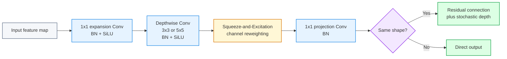

# EfficientNet-B4 Explanation

## Code Context

Amader notebook-e EfficientNet-B4 evabe load kora hoyeche:

```python
self.model = models.efficientnet_b4(
    weights=models.EfficientNet_B4_Weights.IMAGENET1K_V1
)
```

Tarpor original ImageNet classifier replace kore custom 3-class classifier deya hoyeche:

```python
in_features = self.model.classifier[1].in_features
self.model.classifier = nn.Sequential(
    nn.Dropout(p=0.4),
    nn.Linear(in_features, num_classes),
)
```

So, amader model holo:

**ImageNet-1K pretrained EfficientNet-B4 backbone + custom 3-class classification head**

Output classes:

- Benign
- Malignant
- Normal

Important: amader code-e input image size `256 x 256`, tai niche feature-map sizes `256 x 256` input onujayi deya.

---

## 1. Full EfficientNet-B4 Architecture

```mermaid
flowchart LR
    A["Input<br/>RGB ultrasound image<br/>3 x 256 x 256"]

    B["Stem Conv<br/>Conv2d + BN + SiLU<br/>3 to 48<br/>48 x 128 x 128"]

    C["MBConv Stage 1<br/>features.1<br/>48 to 24<br/>24 x 128 x 128"]

    D["MBConv Stage 2<br/>features.2<br/>24 to 32<br/>32 x 64 x 64"]

    E["MBConv Stage 3<br/>features.3<br/>32 to 56<br/>56 x 32 x 32"]

    F["MBConv Stage 4<br/>features.4<br/>56 to 112<br/>112 x 16 x 16"]

    G["MBConv Stage 5<br/>features.5<br/>112 to 160<br/>160 x 16 x 16"]

    H["MBConv Stage 6<br/>features.6<br/>160 to 272<br/>272 x 8 x 8"]

    I["MBConv Stage 7<br/>features.7<br/>272 to 448<br/>448 x 8 x 8"]

    J["Final Conv<br/>features.8<br/>448 to 1792<br/>1792 x 8 x 8"]

    K["Adaptive AvgPool<br/>1792 x 1 x 1"]

    L["Flatten<br/>1792 features"]

    M["Custom Head<br/>Dropout p = 0.4<br/>Linear 1792 to 3"]

    N["Three logits<br/>Benign / Malignant / Normal"]

    A --> B --> C --> D --> E --> F --> G --> H --> I --> J --> K --> L --> M --> N

    classDef input fill:#f5f7fa,stroke:#64748b,stroke-width:1.5px;
    classDef backbone fill:#e6f3ff,stroke:#1e88e5,stroke-width:1.5px;
    classDef pool fill:#fff7d6,stroke:#d97706,stroke-width:1.5px;
    classDef head fill:#dcffe4,stroke:#16a34a,stroke-width:1.5px;
    classDef output fill:#ffe4e6,stroke:#e11d48,stroke-width:1.5px;

    class A input;
    class B,C,D,E,F,G,H,I,J backbone;
    class K,L pool;
    class M head;
    class N output;
```



Color meaning:

- Blue = pretrained EfficientNet-B4 backbone
- Yellow = feature pooling / flatten
- Green = custom trainable classification head
- Red = output logits

---

## 2. Input: 3 x 256 x 256

Model-er input holo RGB ultrasound image.

- `3` means RGB channels
- `256 x 256` means image height and width
- Classification model-e only image jay, mask jay na

Single image:

```text
3 x 256 x 256
```

Batch input:

```text
B x 3 x 256 x 256
```

`B` means batch size.

Simple meaning:

**EfficientNet-B4 ekta 3-channel 256 by 256 ultrasound image ney and final-e 3 class score output kore.**

---

## 3. EfficientNet-B4 Type

EfficientNet-B4 holo **CNN-based classification model**.

Eta transformer na. Eta mainly convolution-based feature extraction use kore.

EfficientNet-er main components:

- Conv layers
- MBConv blocks
- Depthwise convolution
- Squeeze-and-Excitation
- BatchNorm
- SiLU activation
- Global average pooling
- Classification head

Simple meaning:

**EfficientNet-B4 image theke hierarchical CNN feature extract kore, then final classifier diye class predict kore.**

---

## 4. Stem Conv

```text
Stem Conv
Conv2d + BN + SiLU
3 to 48
48 x 128 x 128
```

Stem holo model-er first convolution layer.

Input:

```text
3 x 256 x 256
```

Output:

```text
48 x 128 x 128
```

Meaning:

- `3 to 48`: RGB image 48 feature maps-e convert hoy
- `256 to 128`: stride 2 er jonno spatial size half hoy
- BN feature values stable kore
- SiLU non-linear activation add kore

Simple meaning:

**Stem Conv image-er basic low-level features extract kore, like edges, texture, brightness pattern.**

---

## 5. MBConv Block Mane Ki?

EfficientNet-B4 er main building block holo **MBConv**.

MBConv usually ei pattern follow kore:

```text
1x1 Expansion Conv
Depthwise Conv
Squeeze-and-Excitation
1x1 Projection Conv
Skip connection / Stochastic Depth
```

### 5.1 1x1 Expansion Conv

Feature channel temporarily baray.

Why:

- model-ke richer feature space dey
- complex patterns learn korte help kore

### 5.2 Depthwise Conv

Normal convolution-er cheye efficient.

Depthwise convolution prottek channel separately process kore.

Why:

- computation kom
- local spatial pattern capture kore

### 5.3 Squeeze-and-Excitation

Eta channel attention-er moto kaj kore.

Model decide kore kon channels important, kon channels less important.

Simple meaning:

**SE block feature channel-er importance re-weight kore.**

### 5.4 1x1 Projection Conv

Expanded feature-ke abar target output channel-e reduce kore.

### 5.5 Skip Connection / Stochastic Depth

Jodi input-output compatible hoy, residual/skip connection use hoy.

Stochastic depth training-er somoy kichu residual path randomly drop korte pare, overfitting komate help kore.

Simple meaning:

**MBConv efficient vabe local features extract kore and channel attention diye important features emphasize kore.**

### MBConv Internal Flow Diagram



### MBConv Step-by-Step Explanation

1. **Input feature map**

   Previous layer/stage theke feature map MBConv block-e dhuke.

2. **1x1 expansion Conv + BN + SiLU**

   First `1x1 Conv` channel temporarily expand kore.  
   Example: `32 -> 192` type expansion hote pare.

   Why:

   - richer feature space create kore
   - model-ke more complex pattern learn korte dey

3. **Depthwise Conv 3x3 or 5x5 + BN + SiLU**

   Depthwise Conv prottek channel separately spatial filtering kore.  
   EfficientNet-B4 er different MBConv stages-e `3x3` or `5x5` depthwise kernel use hoy.

   Why:

   - computation efficient
   - local spatial pattern capture kore
   - texture, edge, local tissue pattern learn kore

4. **Squeeze-and-Excitation**

   Ei part channel attention-er moto kaj kore.  
   Eta globally feature map summarize kore, then important channels-ke higher weight and less useful channels-ke lower weight dey.

   Simple meaning:

   **Model nijer feature channels-er importance decide kore.**

5. **1x1 projection Conv + BN**

   Expanded feature-ke target output channel-e project kore.  
   Eta MBConv block-er final channel size set kore.

6. **Same shape?**

   Jodi input and output-er spatial size and channel size same hoy, tahole residual connection possible.

7. **Residual connection + stochastic depth**

   Same shape hole input feature output-er sathe add hoy.  
   Stochastic depth training-er somoy sometimes residual path drop kore, regularization-er moto kaj kore.

8. **Direct output**

   Jodi shape same na hoy, residual add kora jay na. Tokhon block direct output dey.

Presentation-safe line:

**Each MBConv block expands channels, applies efficient depthwise convolution, recalibrates channels using Squeeze-and-Excitation, projects features back, and uses residual connection when input-output shapes match.**

---

## 6. MBConv Stage 1

```text
features.1
48 to 24
24 x 128 x 128
```

Input:

```text
48 x 128 x 128
```

Output:

```text
24 x 128 x 128
```

Eta early low-level feature processing stage.

Spatial size same thake:

```text
128 x 128
```

Simple meaning:

**Stage 1 shallow image features refine kore, resolution same rakhe.**

---

## 7. MBConv Stage 2

```text
features.2
24 to 32
32 x 64 x 64
```

Input:

```text
24 x 128 x 128
```

Output:

```text
32 x 64 x 64
```

Meaning:

- spatial size half hoy: `128 to 64`
- channels increase hoy: `24 to 32`

Simple meaning:

**Stage 2 feature map smaller kore and feature depth baray.**

---

## 8. MBConv Stage 3

```text
features.3
32 to 56
56 x 32 x 32
```

Input:

```text
32 x 64 x 64
```

Output:

```text
56 x 32 x 32
```

Meaning:

- spatial size half hoy: `64 to 32`
- channels increase hoy: `32 to 56`

Simple meaning:

**Stage 3 mid-level ultrasound patterns learn kore, like tissue texture and lesion boundary hints.**

---

## 9. MBConv Stage 4

```text
features.4
56 to 112
112 x 16 x 16
```

Input:

```text
56 x 32 x 32
```

Output:

```text
112 x 16 x 16
```

Meaning:

- spatial size `32 to 16`
- channels `56 to 112`

Simple meaning:

**Stage 4 more abstract feature learn kore, local texture theke larger region pattern-e jay.**

---

## 10. MBConv Stage 5

```text
features.5
112 to 160
160 x 16 x 16
```

Input:

```text
112 x 16 x 16
```

Output:

```text
160 x 16 x 16
```

Spatial size same:

```text
16 x 16
```

Simple meaning:

**Stage 5 same resolution-e deeper feature representation refine kore.**

---

## 11. MBConv Stage 6

```text
features.6
160 to 272
272 x 8 x 8
```

Input:

```text
160 x 16 x 16
```

Output:

```text
272 x 8 x 8
```

Meaning:

- spatial size `16 to 8`
- channels `160 to 272`

Simple meaning:

**Stage 6 compact but stronger semantic feature representation create kore.**

---

## 12. MBConv Stage 7

```text
features.7
272 to 448
448 x 8 x 8
```

Input:

```text
272 x 8 x 8
```

Output:

```text
448 x 8 x 8
```

Spatial size same:

```text
8 x 8
```

Simple meaning:

**Stage 7 final high-level CNN features refine kore, classification-er jonno important abstract patterns capture kore.**

---

## 13. Final Conv

```text
features.8
448 to 1792
1792 x 8 x 8
```

Input:

```text
448 x 8 x 8
```

Output:

```text
1792 x 8 x 8
```

Eta final feature expansion layer.

Simple meaning:

**Final Conv high-level feature channel 1792 porjonto expand kore, so final classifier rich image representation pay.**

---

## 14. Adaptive AvgPool

```text
Adaptive AvgPool
1792 x 1 x 1
```

Input:

```text
1792 x 8 x 8
```

Output:

```text
1792 x 1 x 1
```

Global spatial information average hoy.

Simple meaning:

**8x8 feature map-ke average kore ekta image-level summary banano hoy.**

---

## 15. Flatten

```text
Flatten
1792 features
```

AvgPool output:

```text
1792 x 1 x 1
```

Flatten-er por:

```text
1792
```

Simple meaning:

**Feature map-ke classifier-er jonno one-dimensional feature vector-e convert kora hoy.**

---

## 16. Custom Head

```text
Dropout p = 0.4
Linear 1792 to 3
```

Original EfficientNet-B4 ImageNet classifier chilo:

```text
Dropout -> Linear 1792 to 1000
```

Amader code eta replace kore:

```text
Dropout 0.4 -> Linear 1792 to 3
```

Why:

- ImageNet has 1000 classes
- BUSI classification has 3 classes

Dropout overfitting komate help kore.

Simple meaning:

**Custom head 1792-dimensional feature vector-ke benign, malignant, normal ei 3 class score-e convert kore.**

---

## 17. Three Logits

Output:

```text
[benign score, malignant score, normal score]
```

Egula raw logits, probability na.

Softmax apply korle probability hoy.

Highest probability class final prediction.

Simple meaning:

**EfficientNet-B4 final-e image-ta benign, malignant, naki normal seta predict kore.**

---

## 18. Backbone and Head

### Backbone

Backbone mane pretrained feature extractor part:

```text
Stem Conv
MBConv Stage 1 to Stage 7
Final Conv
Adaptive AvgPool
Flatten
```

Backbone ImageNet-1K pretrained.

### Head

Head mane amader task-specific classifier:

```text
Dropout 0.4
Linear 1792 to 3
```

Head newly defined for BUSI 3-class classification.

Presentation-safe line:

**The EfficientNet-B4 backbone is pretrained on ImageNet-1K, and we replace the original 1000-class head with a custom Dropout 0.4 and Linear 3-class head.**

---

## 19. Phase 1 Freeze Context

Training-er Phase 1-e backbone freeze korle mainly pretrained feature extractor stable thake.

EfficientNet-B4 er backbone:

```text
features + avgpool
```

Custom classification head:

```text
classifier = Dropout 0.4 -> Linear 3
```

Important code nuance:

Notebook-er freeze function name-based. EfficientNet-er internal classifier-er final Linear definitely trainable thake, but kichu naming behavior framework-er upor depend korte pare. Presentation-e simple kore bolte paro:

**In the initial phase, the pretrained feature extractor is kept mostly frozen and the custom classification head learns the BUSI classes.**

---

## 20. Full Speaking Script

For EfficientNet-B4, amader code ImageNet-1K pretrained torchvision EfficientNet-B4 model use kore. Eta CNN-based classifier. Input holo 3-channel 256 by 256 ultrasound image. First-e stem convolution image-ke 48 feature map-e convert kore and resolution 128 by 128 kore. Tarpor image features multiple MBConv stages-er moddhe jay. MBConv blocks efficient convolution, depthwise convolution, Squeeze-and-Excitation, BatchNorm, SiLU activation, and residual-style connections use kore. Stage by stage spatial resolution komte thake and channel depth barte thake, for example 48 by 128 by 128 theke final-e 1792 by 8 by 8 feature map hoy. Then Adaptive Average Pooling ei 8 by 8 feature map-ke 1792-dimensional image-level feature vector-e convert kore. Finally, amra original ImageNet 1000-class classifier replace kore Dropout 0.4 and Linear 1792 to 3 use korechi, so model benign, malignant, and normal ei 3 class-er logits output kore.

---

## 21. Short Presentation Points

- EfficientNet-B4 is a CNN-based classifier.
- It is pretrained on ImageNet-1K.
- Input image size is `3 x 256 x 256`.
- Backbone uses Stem Conv + MBConv stages + Final Conv.
- MBConv uses efficient convolution, depthwise convolution, and Squeeze-and-Excitation.
- Feature progression with 256 input:
  - `3 x 256 x 256`
  - `48 x 128 x 128`
  - `24 x 128 x 128`
  - `32 x 64 x 64`
  - `56 x 32 x 32`
  - `112 x 16 x 16`
  - `160 x 16 x 16`
  - `272 x 8 x 8`
  - `448 x 8 x 8`
  - `1792 x 8 x 8`
- Adaptive AvgPool produces `1792` image features.
- Original ImageNet head is replaced with `Dropout 0.4 -> Linear 3`.
- Final output classes are Benign, Malignant, and Normal.
