# MobileViTv2-100 Explanation

## Code Context

Amader notebook-e MobileViTv2-100 evabe load kora hoyeche:

```python
self.model = timm.create_model("mobilevitv2_100", pretrained=True)
```

Tarpor original classification head replace kore custom 3-class head deya hoyeche:

```python
in_features = self.model.head.fc.in_features
self.model.head.fc = nn.Sequential(
    nn.Dropout(p=0.3),
    nn.Linear(in_features, num_classes),
)
```

So, amader model holo:

**timm pretrained MobileViTv2-100 backbone + custom 3-class classification head**

Output classes:

- Benign
- Malignant
- Normal

Important naming note:

Notebook-e dictionary key/history file-e model name `MobileViT-S` bola hoyeche, but actual loaded architecture holo:

```text
mobilevitv2_100
```

So presentation-e safest wording:

**MobileViTv2-100**

---

## 1. Full MobileViTv2-100 Architecture

```mermaid
flowchart LR
    A["Input<br/>RGB ultrasound image<br/>3 x 256 x 256"]

    B["Stem Conv<br/>Conv + BN + SiLU<br/>3 to 32<br/>32 x 128 x 128"]

    C["Stage 0<br/>BottleneckBlock<br/>32 to 64<br/>64 x 128 x 128"]

    D["Stage 1<br/>BottleneckBlocks<br/>64 to 128<br/>128 x 64 x 64"]

    E["Stage 2<br/>BottleneckBlock + MobileViTv2Block<br/>128 to 256<br/>256 x 32 x 32"]

    F["Stage 3<br/>BottleneckBlock + MobileViTv2Block<br/>256 to 384<br/>384 x 16 x 16"]

    G["Stage 4<br/>BottleneckBlock + MobileViTv2Block<br/>384 to 512<br/>512 x 8 x 8"]

    H["Final Conv<br/>Identity in this timm model<br/>512 x 8 x 8"]

    I["Global Average Pooling<br/>512 features"]

    J["Custom Head<br/>Dropout p = 0.3<br/>Linear 512 to 3"]

    K["Three logits<br/>Benign / Malignant / Normal"]

    A --> B --> C --> D --> E --> F --> G --> H --> I --> J --> K

    classDef input fill:#f5f7fa,stroke:#64748b,stroke-width:1.5px;
    classDef cnn fill:#e6f3ff,stroke:#1e88e5,stroke-width:1.5px;
    classDef hybrid fill:#f3e8ff,stroke:#9333ea,stroke-width:1.5px;
    classDef pool fill:#fff7d6,stroke:#d97706,stroke-width:1.5px;
    classDef head fill:#dcffe4,stroke:#16a34a,stroke-width:1.5px;
    classDef output fill:#ffe4e6,stroke:#e11d48,stroke-width:1.5px;

    class A input;
    class B,C,D cnn;
    class E,F,G,H hybrid;
    class I pool;
    class J head;
    class K output;
```



Color meaning:

- Blue = CNN/local feature extraction blocks
- Purple = hybrid MobileViTv2 blocks with local convolution + transformer-style global representation
- Yellow = global pooling
- Green = custom classification head
- Red = output logits

---

## 2. Input: 3 x 256 x 256

Model-er input holo RGB ultrasound image.

- `3` means RGB channels
- `256 x 256` means image height and width
- Classification model-e only image jay, mask jay na

Single image:

```text
3 x 256 x 256
```

Batch input:

```text
B x 3 x 256 x 256
```

`B` means batch size.

Simple meaning:

**MobileViTv2-100 ekta 3-channel 256 by 256 ultrasound image ney and final-e 3 class score output kore.**

---

## 3. MobileViTv2-100 Type

MobileViTv2-100 holo **hybrid CNN-Transformer model**.

Eta pure CNN na, pure Transformer-o na.

Eta combine kore:

- CNN local feature extraction
- Transformer-style global/context feature learning
- lightweight/mobile-friendly design

Simple meaning:

**CNN local texture and boundary-type pattern dhore, ar MobileViT blocks image-er wider/global relationship learn korte help kore.**

---

## 4. Stem Conv

```text
Stem Conv
Conv + BN + SiLU
3 to 32
32 x 128 x 128
```

Input:

```text
3 x 256 x 256
```

Output:

```text
32 x 128 x 128
```

Meaning:

- RGB image 32 feature maps-e convert hoy
- stride 2 er jonno spatial size half hoy
- BN training stable kore
- SiLU activation non-linearity add kore

Simple meaning:

**Stem Conv image-er initial low-level features extract kore.**

---

## 5. Stage 0

```text
Stage 0
BottleneckBlock
32 to 64
64 x 128 x 128
```

Input:

```text
32 x 128 x 128
```

Output:

```text
64 x 128 x 128
```

Eta CNN-style BottleneckBlock.

Spatial size same thake:

```text
128 x 128
```

Simple meaning:

**Stage 0 low-level local features refine kore and channels 32 theke 64 kore.**

---

## 6. Stage 1

```text
Stage 1
BottleneckBlocks
64 to 128
128 x 64 x 64
```

Input:

```text
64 x 128 x 128
```

Output:

```text
128 x 64 x 64
```

Meaning:

- spatial size half hoy: `128 to 64`
- channels increase hoy: `64 to 128`

Simple meaning:

**Stage 1 local CNN features deeper kore and resolution reduce kore.**

---

## 7. Stage 2

```text
Stage 2
BottleneckBlock + MobileViTv2Block
128 to 256
256 x 32 x 32
```

Input:

```text
128 x 64 x 64
```

Output:

```text
256 x 32 x 32
```

Stage 2-te first BottleneckBlock local CNN feature process kore, then MobileViTv2Block global/context feature learn kore.

Simple meaning:

**Stage 2 theke model local CNN feature-er sathe transformer-style global representation combine kora start kore.**

---

## 8. Stage 3

```text
Stage 3
BottleneckBlock + MobileViTv2Block
256 to 384
384 x 16 x 16
```

Input:

```text
256 x 32 x 32
```

Output:

```text
384 x 16 x 16
```

Meaning:

- spatial size `32 to 16`
- channels `256 to 384`
- local + global features aro deeper hoy

Simple meaning:

**Stage 3 lesion/tissue-related higher-level pattern capture korte help kore.**

---

## 9. Stage 4

```text
Stage 4
BottleneckBlock + MobileViTv2Block
384 to 512
512 x 8 x 8
```

Input:

```text
384 x 16 x 16
```

Output:

```text
512 x 8 x 8
```

Eta final high-level feature extraction stage.

Simple meaning:

**Stage 4 compact but rich feature representation create kore, jeta final classification-er jonno use hoy.**

---

## 10. MobileViTv2Block Kibhabe Kaj Kore?

MobileViTv2Block-er internal structure simplified:


Step-by-step:

1. **Input feature map**

   CNN stage theke feature map MobileViTv2Block-e dhuke.

2. **Local depthwise Conv**

   Local spatial feature refine kore.  
   Eta nearby pixel/patch pattern capture kore.

3. **1x1 Conv projection**

   CNN feature-ke transformer dimension-e project kore.

4. **Linear Transformer Blocks**

   Ekhane GroupNorm, Linear Self-Attention, and Conv MLP use hoy.

   Purpose:

   - larger context capture kora
   - image-er different region-er relation learn kora
   - computation efficient rakha

5. **GroupNorm**

   Transformer output normalize kore.

6. **1x1 Conv projection back**

   Transformer feature-ke abar CNN channel format-e convert kore.

Simple meaning:

**MobileViTv2Block local CNN feature and global transformer-style context combine kore.**

---

## 11. Linear Self-Attention

MobileViTv2 normal expensive self-attention-er instead **Linear Self-Attention** use kore.

Why:

- computation kom
- lightweight model rakhe
- mobile-friendly
- global context learn korte help kore

Simple meaning:

**Linear Self-Attention efficient vabe image-er wider context capture kore.**

---

## 12. BottleneckBlock Mane Ki?

MobileViTv2-100 er early stages-e BottleneckBlock use hoy.

Typical idea:

```text
1x1 Conv
Depthwise 3x3 Conv
1x1 Conv
optional residual/shortcut
```

Purpose:

- efficient local feature extraction
- computation kom rakha
- early image texture and edge feature learn kora

Simple meaning:

**BottleneckBlock CNN-style efficient local feature extractor.**

---

## 13. Final Conv

```text
Final Conv
Identity in this timm model
512 x 8 x 8
```

In this timm `mobilevitv2_100` model, `final_conv` is `Identity`.

Meaning:

Eta kono extra channel change kore na.

Input:

```text
512 x 8 x 8
```

Output:

```text
512 x 8 x 8
```

Simple meaning:

**Stage 4-er final 512-channel feature map directly classification head-er dike jay.**

---

## 14. Global Average Pooling

```text
Global Average Pooling
512 features
```

Input:

```text
512 x 8 x 8
```

Output:

```text
512 features
```

Global average pooling spatial information average kore single image-level vector banay.

Simple meaning:

**8x8 feature map-ke average kore 512-dimensional image representation banano hoy.**

---

## 15. Custom Head

```text
Dropout p = 0.3
Linear 512 to 3
```

Original timm MobileViTv2-100 head chilo ImageNet classification-er jonno.

Amader code-e `head.fc` replace kora hoy:

```text
Dropout 0.3 -> Linear 512 to 3
```

Why:

- BUSI classification has 3 classes
- Dropout overfitting reduce korte help kore

Simple meaning:

**Custom head 512-dimensional image feature-ke benign, malignant, normal ei 3 class score-e convert kore.**

---

## 16. Three Logits

Output:

```text
[benign score, malignant score, normal score]
```

Egula raw logits.

Softmax apply korle probability hoy.

Highest probability class final prediction.

Simple meaning:

**MobileViTv2-100 final-e image-ta benign, malignant, naki normal seta predict kore.**

---

## 17. Backbone and Head

### Backbone

Backbone mane pretrained feature extractor:

```text
Stem
Stages 0 to 4
Final Conv / Identity
Global Pool
```

### Head

Custom task-specific classifier:

```text
Dropout 0.3
Linear 512 to 3
```

Presentation-safe line:

**The MobileViTv2-100 backbone is pretrained, while we replace the original classifier with a custom Dropout 0.3 and Linear 3-class head for BUSI classification.**

---

## 18. Full Speaking Script

For MobileViTv2-100, amader code timm library theke pretrained `mobilevitv2_100` model load kore. Eta ekta hybrid CNN-Transformer classifier. Input holo 3-channel 256 by 256 ultrasound image. First-e Stem Conv image-ke 32 feature map-e convert kore and resolution 128 by 128 kore. Tarpor early stages CNN-style BottleneckBlocks use kore local features learn kore. Stage 2 theke MobileViTv2Blocks add hoy, jekhane local depthwise convolution-er sathe Linear Self-Attention use kore wider/global context capture kora hoy. Stage by stage resolution komte thake and channel depth barte thake: 32, 64, 128, 256, 384, and finally 512 channels. Final feature map hoy 512 by 8 by 8. Then Global Average Pooling ei feature map-ke 512-dimensional image feature vector-e convert kore. Finally, amra original classifier replace kore Dropout 0.3 and Linear 512 to 3 use korechi, so model benign, malignant, and normal ei 3 class-er logits output kore.

---

## 19. Short Presentation Points

- MobileViTv2-100 is a hybrid CNN-Transformer classifier.
- It is loaded using `timm.create_model("mobilevitv2_100", pretrained=True)`.
- Input image size is `3 x 256 x 256`.
- Early stages use CNN-style BottleneckBlocks.
- Later stages use MobileViTv2Blocks.
- MobileViTv2Block combines local depthwise convolution and Linear Self-Attention.
- Feature progression with 256 input:
  - `3 x 256 x 256`
  - `32 x 128 x 128`
  - `64 x 128 x 128`
  - `128 x 64 x 64`
  - `256 x 32 x 32`
  - `384 x 16 x 16`
  - `512 x 8 x 8`
- Global Average Pooling produces `512` image features.
- Original head is replaced with `Dropout 0.3 -> Linear 3`.
- Final output classes are Benign, Malignant, and Normal.

