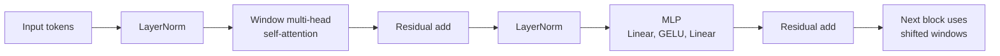

# Swin Transformer Tiny Explanation

## Code Context

Amader notebook-e Swin Transformer Tiny evabe load kora hoyeche:

```python
self.model = models.swin_t(weights=models.Swin_T_Weights.IMAGENET1K_V1)
```

Tarpor original ImageNet classification head replace kore custom 3-class head deya hoyeche:

```python
self.model.head = nn.Sequential(
    nn.Dropout(p=0.3),
    nn.Linear(in_features, num_classes)
)
```

So, amader model holo:

**ImageNet-1K pretrained Swin-T backbone + custom 3-class classification head**

Output classes:

- Benign
- Malignant
- Normal

---

## 1. Full Swin-T Architecture

```mermaid
flowchart LR
    A["Input<br/>3 x 256 x 256"] --> B["Patch embedding<br/>4x4 Conv, stride 4<br/>64 x 64 tokens, C=96"]
    B --> C1["Stage 1<br/>2 Swin blocks<br/>C=96, heads=3"]
    C1 --> M1["Patch merging<br/>32 x 32, C=192"]
    M1 --> C2["Stage 2<br/>2 Swin blocks<br/>C=192, heads=6"]
    C2 --> M2["Patch merging<br/>16 x 16, C=384"]
    M2 --> C3["Stage 3<br/>6 Swin blocks<br/>C=384, heads=12"]
    C3 --> M3["Patch merging<br/>8 x 8, C=768"]
    M3 --> C4["Stage 4<br/>2 Swin blocks<br/>C=768, heads=24"]
    C4 --> D["LayerNorm"]
    D --> E["Global average pooling<br/>768 features"]
    E --> F["Custom Dropout<br/>p = 0.3"]
    F --> G["Custom Linear<br/>768 to 3"]
    G --> H["Three logits"]
```



---

## 2. Input: 3 x 256 x 256

Model-er input holo ekta RGB ultrasound image.

- `3` means 3 image channels: Red, Green, Blue.
- `256 x 256` means image height and width.
- Notebook-e images resize kore `256 x 256` kora hoy.

Ultrasound image visually grayscale holeo model-e RGB format-e jay, karon pretrained Swin-T 3-channel input expect kore.

Single image shape:

```text
3 x 256 x 256
```

Batch input shape:

```text
B x 3 x 256 x 256
```

Ekhane `B` means batch size.

---

## 3. Patch Embedding

```text
Patch embedding
4x4 Conv, stride 4
64 x 64 tokens, C=96
```

Swin Transformer image-ke direct full image hisebe process kore na. Age image-ke small patch/token-e convert kore. Ei step-ke bole **Patch Embedding**.

Torchvision Swin-T te patch embedding hoy:

```text
Conv2d 3 to 96, kernel size 4, stride 4
```

Meaning:

- Input channel: `3`
- Output channel: `96`
- Patch size: `4 x 4`
- Stride: `4`

Input image size:

```text
256 x 256
```

Patch size/stride 4, tai:

```text
256 / 4 = 64
```

Output:

```text
64 x 64 tokens, C=96
```

Total token:

```text
64 x 64 = 4096 tokens
```

Prottek token-er feature dimension holo 96.

Simple meaning:

**Original image-ke 4x4 small patches-e divide kora hoy, then prottek patch-ke 96-dimensional feature token-e convert kora hoy.**

---

## 4. Stage 1

```text
Stage 1
2 Swin blocks
C=96, heads=3
```

Patch embedding-er por first processing stage holo **Stage 1**.

Input:

```text
64 x 64 tokens, C=96
```

Ei stage-e ache:

- 2 ta Swin Transformer block
- 96 feature channels
- 3 ta attention heads

`heads=3` means Multi-Head Self-Attention 3 ta parallel attention view/perspective theke kaj kore.

Each head dimension:

```text
96 / 3 = 32
```

Stage 1 spatial resolution same rakhe:

```text
64 x 64, C=96
```

Simple meaning:

**Stage 1 low-level local relationship learn kore, like texture, edge, brightness pattern, and ultrasound tissue pattern.**

---

## 5. Swin Transformer Block

Prottek Swin block-er internal flow:



Now each part:

### 5.1 Input Tokens

Input tokens holo previous step theke asha patch features.

Example Stage 1:

```text
64 x 64 tokens, C=96
```

Prottek token image-er ekta small patch/region represent kore.

---

### 5.2 First LayerNorm

LayerNorm token feature values normalize kore attention-er age.

Why:

- feature scale stable rakhe
- training smoother kore
- attention calculation easier kore

Simple meaning:

**Self-attention-er age token features-ke stable/clean scale-e ana hoy.**

---

### 5.3 Window Multi-Head Self-Attention

Self-attention means model check kore ek token/image patch onno token-er sathe koto related.

But Swin full image-er shob token-er sathe shob token compare kore na. Eta token grid-ke small local **window**-te divide kore, then prottek window-er vitore attention kore.

Why window attention:

- full self-attention computationally expensive
- window attention faster
- local image pattern capture korte effective

Multi-head means multiple attention heads different relation learn kore.

Example:

- one head texture relation dhorte pare
- one head boundary relation dhorte pare
- one head tissue-context relation dhorte pare

Simple meaning:

**Window attention local region-er patch tokens-er moddhe relationship learn kore.**

---

### 5.4 Residual Add

Attention output original input token-er sathe add hoy:

```text
x = x + attention(LayerNorm(x))
```

Why:

- original information preserve kore
- gradient flow improve kore
- deep transformer train kora easier kore

Simple meaning:

**Model notun attention information add kore, but old token information lose kore na.**

---

### 5.5 Second LayerNorm

First residual add-er por MLP-er age abar LayerNorm hoy.

Formula:

```text
x = x + attention(LayerNorm(x))
x = x + MLP(LayerNorm(x))
```

Simple meaning:

**MLP-er age updated token features-ke abar normalize kora hoy.**

---

### 5.6 MLP: Linear, GELU, Linear

MLP holo transformer block-er feed-forward part.

Eta prottek token feature independently refine kore.

Structure:

```text
Linear -> GELU -> Linear
```

Stage 1 example:

```text
96 -> 384 -> 96
```

Why:

- first Linear feature dimension expand kore
- GELU non-linearity add kore
- second Linear dimension abar original size-e niye ashe

Simple meaning:

**MLP attention-er por prottek token-er feature representation aro refine kore.**

---

### 5.7 Final Residual Add

MLP output abar token features-er sathe add hoy:

```text
x = x + MLP(LayerNorm(x))
```

Why:

- previous information preserve kore
- refined features add kore
- training stable kore

Simple meaning:

**Block-er final-e old information + new refined feature combine hoy.**

---

## 6. Regular Window and Shifted Window

Swin Transformer alternate kore:

1. Regular window attention
2. Shifted window attention

Regular window attention-e token only nijer window-er moddhe communication kore.

Problem:

Different window-er token directly communicate korte pare na.

Solution:

Next block-e window position shift kora hoy. Tai neighboring windows-er information exchange hoy.

Simple meaning:

**Regular window local information learn kore, shifted window neighboring window-er sathe information connect kore.**

Eta Swin Transformer-er main innovation.

Presentation-safe line:

**Swin Transformer uses shifted-window self-attention to efficiently learn both local and cross-window relationships.**

---

## 7. Patch Merging

Stage 1-er por **Patch Merging** hoy.

```text
Patch merging
32 x 32, C=192
```

Patch merging spatial resolution komay and channel dimension baray.

Before:

```text
64 x 64, C=96
```

After:

```text
32 x 32, C=192
```

Simple meaning:

**Patch merging CNN downsampling-er moto. Feature map smaller hoy, but feature depth increase hoy.**

Eta Swin-ke hierarchical model banay, CNN-er moto multi-stage feature extraction kore.

---

## 8. Stage 2

```text
Stage 2
2 Swin blocks
C=192, heads=6
```

Input:

```text
32 x 32 tokens, C=192
```

Ei stage:

- resolution `32 x 32` rakhe
- 2 ta Swin block use kore
- 6 attention heads use kore
- Stage 1-er cheye deeper features process kore

Simple meaning:

**Stage 2 mid-level ultrasound pattern learn kore, like tissue texture and region-level structure.**

---

## 9. Patch Merging 2

Stage 3-er age:

```text
32 x 32, C=192
```

Patch merging-er por:

```text
16 x 16, C=384
```

Simple meaning:

**Resolution komche, feature channel barche.**

---

## 10. Stage 3

```text
Stage 3
6 Swin blocks
C=384, heads=12
```

Input:

```text
16 x 16 tokens, C=384
```

Stage 3 Swin-T er longest main processing stage.

Eta use kore:

- 6 ta Swin block
- 384 feature channels
- 12 attention heads

Simple meaning:

**Stage 3 more abstract and semantically meaningful patterns learn kore.**

BUSI classification-e eta lesion-related context, texture variation, and tissue structure capture korte help korte pare.

---

## 11. Patch Merging 3

Stage 4-er age:

```text
16 x 16, C=384
```

Patch merging-er por:

```text
8 x 8, C=768
```

Simple meaning:

**Image representation compact hoy, but information-rich hoy.**

---

## 12. Stage 4

```text
Stage 4
2 Swin blocks
C=768, heads=24
```

Input:

```text
8 x 8 tokens, C=768
```

Eta final Swin feature extraction stage.

Eta use kore:

- 2 ta Swin block
- 768 feature channels
- 24 attention heads

Simple meaning:

**Stage 4 high-level class-related information capture kore, jeta final classification-e use hoy.**

---

## 13. LayerNorm

Final Swin stage-er por LayerNorm apply hoy.

Purpose:

- final token features normalize kora
- pooling/classification-er age stable representation banano

Simple meaning:

**Final feature tokens-ke classification-er age stable kora hoy.**

---

## 14. Global Average Pooling

```text
Global average pooling
768 features
```

Ei point-e model-er feature representation:

```text
8 x 8 tokens, C=768
```

Global average pooling spatial/token information average kore ekta vector banay:

```text
768 features
```

Simple meaning:

**Shob patch/token information summarize hoye ekta 768-dimensional image-level feature vector hoy.**

---

## 15. Custom Dropout

```text
Dropout p = 0.3
```

Dropout training-er somoy randomly kichu features disable kore.

Why:

- overfitting komay
- generalization improve kore
- BUSI dataset relatively small, tai helpful

Simple meaning:

**Dropout model-ke specific feature-er upor overly dependent hote dey na.**

---

## 16. Custom Linear Layer

```text
Linear 768 to 3
```

Original Swin-T ImageNet head-er output chilo 1000 classes.

Amader code-e eta replace kora hoy:

```text
Linear 768 to 3
```

Karon amader task-e 3 classes:

- Benign
- Malignant
- Normal

Simple meaning:

**Final Linear layer 768-dimensional image feature-ke 3 ta class score-e convert kore.**

---

## 17. Three Logits

Model output dey 3 ta logits:

```text
[benign score, malignant score, normal score]
```

Logits holo raw scores, probability na.

Evaluation/inference-er somoy softmax logits-ke probability-te convert kore.

Highest probability class final prediction hoy.

Simple meaning:

**Swin-T final-e bole image-ta benign, malignant, naki normal howar chance beshi.**

---

## 18. Full Speaking Script

For Swin Transformer Tiny, amader code ImageNet-1K pretrained torchvision Swin-T model use kore. Input holo 3-channel 256 by 256 ultrasound image. First-e image-ke 4 by 4 stride-4 convolution diye patch token-e convert kora hoy, jar output 64 by 64 token grid with 96 channels. Tarpor tokens four hierarchical Swin stages-er moddhe jay. Stage depth holo 2, 2, 6, and 2 blocks, and feature dimensions holo 96, 192, 384, and 768. Prottek stage-er moddhe Swin blocks token features process kore using window-based multi-head self-attention. Stage-er majhe patch merging spatial size komay and feature depth baray. Inside each Swin block, LayerNorm, window self-attention, residual connection, second LayerNorm, MLP, and another residual connection thake. Swin regular-window and shifted-window attention alternate kore, tai local and cross-window relationships efficiently learn korte pare. Finally, feature tokens LayerNorm and global average pooling-er maddhome 768-dimensional image feature-e convert hoy. Amra original ImageNet head replace kore Dropout 0.3 and Linear 768 to 3 use korechi for benign, malignant, and normal classification.

---

## 19. Short Presentation Points

- Swin-T is a transformer-based classifier.
- It is pretrained on ImageNet-1K.
- Input image size is `3 x 256 x 256`.
- Patch embedding uses `4x4 Conv, stride 4`.
- Output after patch embedding is `64 x 64 tokens, C=96`.
- Four Swin stages use block depths `2, 2, 6, 2`.
- Feature dimensions are `96, 192, 384, 768`.
- Attention heads are `3, 6, 12, 24`.
- Main mechanism is shifted-window self-attention.
- Patch merging creates hierarchical features.
- Original ImageNet head is replaced with `Dropout 0.3 -> Linear 3`.
- Final output classes are Benign, Malignant, and Normal.

