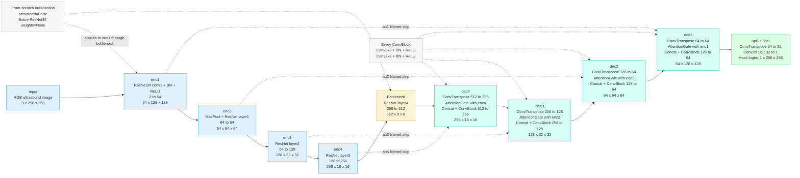
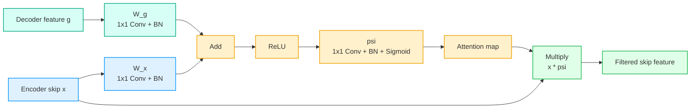

# Attention U-Net From Scratch Explanation

## Code Context

Amader notebook-e from-scratch Attention U-Net same `AttentionUNet` class diye create kora hoy, but:

```python
AttentionUNet(in_ch=3, out_ch=1, pretrained=False)
```

Class-er moddhe:

```python
if pretrained:
    resnet = models.resnet34(weights=models.ResNet34_Weights.IMAGENET1K_V1)
else:
    resnet = models.resnet34(weights=None)
```

So, from-scratch model-er encoder initialization:

```text
ResNet34 weights = None
```

Important:

```text
Architecture same as pretrained Attention U-Net.
Difference holo encoder weight initialization.
```

---

## 1. Full Attention U-Net From Scratch Architecture



Color meaning:

- Blue = ResNet34 encoder initialized from scratch
- Yellow = bottleneck
- Green/teal = decoder with attention-gated skip connections
- Light green = output mask logits
- Gray = notes

---

## 2. Input

```text
Input
RGB ultrasound image
3 x 256 x 256
```

Model input holo RGB ultrasound image.

- `3` = RGB channels
- `256 x 256` = image height and width
- Model input hisebe only image jay
- Mask training-er target, model input na

Single image:

```text
3 x 256 x 256
```

Batch input:

```text
B x 3 x 256 x 256
```

Simple meaning:

**From-scratch Attention U-Net image ney and corresponding tumour segmentation mask predict kore.**

---

## 3. From-Scratch Initialization

```text
pretrained=False
Entire ResNet34 weights=None
```

Meaning:

ResNet34 encoder ImageNet weights use kore na.

Code-level:

```python
resnet = models.resnet34(weights=None)
```

So:

- encoder random initialization diye start kore
- decoder-o newly initialized
- AttentionGate-o newly initialized
- model BUSI segmentation data theke features learn kore

Important clarification:

```text
From scratch mane architecture scratch theke design kora na.
From scratch mane pretrained weights use kora hoy nai.
```

Presentation-safe line:

**The from-scratch Attention U-Net uses the same architecture as the pretrained version, but the ResNet34 encoder is initialized with weights=None instead of ImageNet weights.**

---

## 4. Encoder and Bottleneck Count

Presentation-e evabe bolte paro:

```text
4 encoder stages
1 bottleneck
4 decoder stages
1 final output stage
```

Encoder:

```text
enc1, enc2, enc3, enc4
```

Bottleneck:

```text
ResNet layer4
```

Decoder:

```text
dec4, dec3, dec2, dec1
```

Final:

```text
up0 + final
```

---

## 5. enc1

```text
enc1
ResNet34 conv1 + BN + ReLU
3 to 64
64 x 128 x 128
```

Input:

```text
3 x 256 x 256
```

Output:

```text
64 x 128 x 128
```

Meaning:

- RGB image 64 feature map-e convert hoy
- spatial size `256 to 128`
- low-level features learn kore, like edge, texture, brightness pattern

From-scratch context:

Ei features age theke learned na. Training-er somoy BUSI data theke learn korte hoy.

---

## 6. enc2

```text
enc2
MaxPool + ResNet layer1
64 to 64
64 x 64 x 64
```

Input:

```text
64 x 128 x 128
```

Output:

```text
64 x 64 x 64
```

Meaning:

- MaxPool spatial size half kore
- ResNet layer1 feature refine kore
- channel same thake

---

## 7. enc3

```text
enc3
ResNet layer2
64 to 128
128 x 32 x 32
```

Input:

```text
64 x 64 x 64
```

Output:

```text
128 x 32 x 32
```

Meaning:

- spatial size `64 to 32`
- channel `64 to 128`
- deeper feature representation create kore

---

## 8. enc4

```text
enc4
ResNet layer3
128 to 256
256 x 16 x 16
```

Input:

```text
128 x 32 x 32
```

Output:

```text
256 x 16 x 16
```

Meaning:

- spatial size `32 to 16`
- channel `128 to 256`
- higher-level tumour/tissue context learn korte start kore

---

## 9. Bottleneck

```text
Bottleneck
ResNet layer4
256 to 512
512 x 8 x 8
```

Input:

```text
256 x 16 x 16
```

Output:

```text
512 x 8 x 8
```

Meaning:

- encoder-er deepest feature representation
- image feature most compressed
- high-level semantic/context information learn kore

Simple meaning:

**Bottleneck image-er compact high-level feature summary create kore.**

---

## 10. AttentionGate Kibhabe Kaj Kore?

Code-er AttentionGate:

```python
g1 = self.W_g(g)
x1 = self.W_x(x)
psi = self.relu(g1 + x1)
psi = self.psi(psi)
return x * psi
```

Here:

- `g` = decoder gating signal
- `x` = encoder skip feature
- `psi` = attention map

Internal flow:



Step-by-step:

1. Decoder feature `g` 1x1 Conv + BN diye process hoy.
2. Encoder skip feature `x` 1x1 Conv + BN diye process hoy.
3. Duita feature add hoy.
4. ReLU apply hoy.
5. `psi` path 1x1 Conv + BN + Sigmoid diye attention map create kore.
6. Encoder skip feature `x` attention map diye multiply hoy.
7. Output hoy filtered skip feature.

Simple meaning:

**AttentionGate skip connection-ke blindly pass kore na; decoder context use kore relevant tumour-region feature filter kore.**

---

## 11. ConvBlock

Code-er ConvBlock:

```text
Conv3x3 + BN + ReLU
Conv3x3 + BN + ReLU
```

Purpose:

- concatenated decoder + filtered skip feature refine kora
- local boundary/detail improve kora
- segmentation feature clean kora

Simple meaning:

**Every decoder stage-e ConvBlock mixed feature-ke refine kore.**

---

## 12. Decoder Common Pattern

Each decoder stage follows:

```text
ConvTranspose
-> AttentionGate on encoder skip
-> Concat
-> ConvBlock
```

Meaning:

- ConvTranspose spatial size double kore
- AttentionGate skip feature filter kore
- Concat decoder and skip features combine kore
- ConvBlock combined feature refine kore

---

## 13. dec4

```text
dec4
ConvTranspose 512 to 256
AttentionGate with enc4
Concat + ConvBlock 512 to 256
256 x 16 x 16
```

Input:

```text
512 x 8 x 8
```

Upsample:

```text
512 x 8 x 8 -> 256 x 16 x 16
```

Skip:

```text
enc4 = 256 x 16 x 16
```

AttentionGate:

```text
enc4 filtered using dec4 signal
```

Concat:

```text
256 + 256 = 512 channels
```

ConvBlock:

```text
512 to 256
```

Output:

```text
256 x 16 x 16
```

---

## 14. dec3

```text
dec3
ConvTranspose 256 to 128
AttentionGate with enc3
Concat + ConvBlock 256 to 128
128 x 32 x 32
```

Input:

```text
256 x 16 x 16
```

Upsample:

```text
256 x 16 x 16 -> 128 x 32 x 32
```

Skip:

```text
enc3 = 128 x 32 x 32
```

Concat:

```text
128 + 128 = 256 channels
```

Output:

```text
128 x 32 x 32
```

---

## 15. dec2

```text
dec2
ConvTranspose 128 to 64
AttentionGate with enc2
Concat + ConvBlock 128 to 64
64 x 64 x 64
```

Input:

```text
128 x 32 x 32
```

Upsample:

```text
128 x 32 x 32 -> 64 x 64 x 64
```

Skip:

```text
enc2 = 64 x 64 x 64
```

Concat:

```text
64 + 64 = 128 channels
```

Output:

```text
64 x 64 x 64
```

---

## 16. dec1

```text
dec1
ConvTranspose 64 to 64
AttentionGate with enc1
Concat + ConvBlock 128 to 64
64 x 128 x 128
```

Input:

```text
64 x 64 x 64
```

Upsample:

```text
64 x 64 x 64 -> 64 x 128 x 128
```

Skip:

```text
enc1 = 64 x 128 x 128
```

Concat:

```text
64 + 64 = 128 channels
```

Output:

```text
64 x 128 x 128
```

---

## 17. up0 + final

```text
up0 + final
ConvTranspose 64 to 32
Conv2d 1x1: 32 to 1
Mask logits: 1 x 256 x 256
```

Input:

```text
64 x 128 x 128
```

up0:

```text
64 x 128 x 128 -> 32 x 256 x 256
```

final:

```text
32 x 256 x 256 -> 1 x 256 x 256
```

Output holo mask logits.

Important:

Logits probability na. Later sigmoid + threshold diye binary mask create hoy.

Simple meaning:

**Final stage original image size-e per-pixel tumour/background score output kore.**

---

## 18. From Scratch vs Pretrained

Same architecture, different initialization.

```text
From-scratch Attention U-Net:
ResNet34 weights = None

Pretrained Attention U-Net:
ResNet34 weights = ImageNet-1K V1
```

What changes:

- architecture change hoy na
- parameter count same thake
- encoder starting weights different
- from-scratch model BUSI data theke feature learn kore from random initialization

Presentation-safe line:

**From scratch does not mean a different architecture; it means the same Attention U-Net architecture is trained without ImageNet pretrained encoder weights.**

---

## 19. Why Include From-Scratch Attention U-Net?

This model is useful as an alternative experiment / baseline comparison.

Purpose:

- pretrained encoder-er benefit check kora
- BUSI-only training performance compare kora
- project-e non-pretrained training experiment show kora

Interpretation:

BUSI dataset relatively small, tai pretrained encoder usually better starting point dey. From-scratch model useful comparison hisebe thake.

Presentation-safe line:

**We trained the same Attention U-Net architecture from scratch to compare BUSI-only learning against ImageNet-pretrained transfer learning.**

---

## 20. Full Speaking Script

For Attention U-Net from scratch, amader architecture pretrained Attention U-Net-er same. Difference holo encoder initialization. Here `pretrained=False`, so ResNet34 encoder uses `weights=None`; no ImageNet pretrained weights are used. Input holo 3-channel 256 by 256 ultrasound image. Encoder-e 4 ta stages ache: enc1, enc2, enc3, and enc4. These stages image feature map-ke gradually downsample kore 64 by 128 by 128 theke 256 by 16 by 16 porjonto niye jay. Bottleneck ResNet layer4 output kore 512 by 8 by 8 high-level feature representation. Decoder side-e ConvTranspose diye feature map upsample hoy. Prottek decoder stage-e encoder skip feature AttentionGate diye filter hoy, then decoder feature-er sathe concatenate hoy and ConvBlock diye refine hoy. Finally up0 feature map-ke 256 by 256 resolution-e niye ashe, and final 1x1 convolution 1-channel mask logits output kore. Ei model mainly use kora hoy pretrained transfer learning-er sathe from-scratch training compare korar jonno.

---

## 21. Short Presentation Points

- Attention U-Net from scratch is a CNN-based segmentation model.
- Architecture same as pretrained Attention U-Net.
- Difference: `pretrained=False`, `ResNet34 weights=None`.
- Input: `3 x 256 x 256` RGB ultrasound image.
- Structure: `4 encoder stages + 1 bottleneck + 4 decoder stages + final output`.
- Bottleneck output: `512 x 8 x 8`.
- Decoder uses ConvTranspose upsampling.
- Skip connections are filtered by AttentionGates.
- Every decoder stage uses ConvBlock.
- ConvBlock: `Conv3x3 + BN + ReLU`, repeated twice.
- Final output: `1 x 256 x 256` mask logits.
- Purpose: compare BUSI-only training against ImageNet-pretrained transfer learning.

