# BUSI Segmentation: Complete Code-Based Explanation

> **Primary source:** `BUSI_FDL_(Final_V).ipynb`  
> **Scope:** Segmentation only  
> **Task:** Breast lesion mask prediction from ultrasound images

---

## 1. Segmentation Stage-er Kaj

Segmentation model prottek pixel-er jonno predict kore pixel-ti tumor region-er
part kina. Input RGB ultrasound image, output single-channel lesion-mask logits.

Full pipeline-e segmentation sob image-e run hoy na:

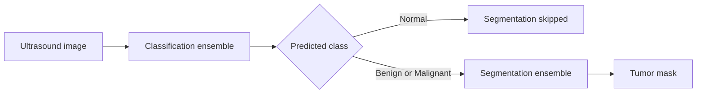

Normal image segmentation dataset thekeo exclude kora hoy, karon normal image-e
tumor target nei.

---

## 2. Four Experiments, Three Unique Architectures

| Experiment | Architecture | Encoder initialization |
|---|---|---|
| Attention U-Net | ResNet34 + attention-gated decoder | ImageNet-1K pretrained |
| U-Net++ | ResNet34 + nested dense decoder | ImageNet-1K pretrained |
| TransUNet | ResNet34 + Transformer bottleneck + decoder | ImageNet-1K pretrained |
| Attention U-Net Scratch | Same Attention U-Net architecture | Random weights |

Therefore, project-e **four segmentation experiments**, but **three unique
architectures**. Pretrained and scratch Attention U-Net-er layer graph and
parameter count identical; initialization and training strategy different.

---

## 3. Mask Preparation

BUSI dataset-e kichu image-er multiple annotation masks chilo:

- Benign: 16 images with multiple masks
- Malignant: 1 image with multiple masks

Code original dataset untouched rekhe `merged/` copy create kore. Multiple masks
pixel-wise maximum, equivalent to logical OR, diye merge kore:

```text
merged_mask = maximum(mask_1, mask_2, ...)
```

Total 17 sets of masks merge hoy. Tarpor subsequent pipeline merged dataset use
kore.

---

## 4. Segmentation Dataset

`BUSISegmentationDataset`:

1. CSV/DataFrame load kore.
2. `normal` rows remove kore.
3. Image RGB-te load kore.
4. Corresponding grayscale mask load kore.
5. Missing mask hole zero mask create kore.
6. Mask-ke threshold `>127` diye binary kore.
7. Image-mask pair-e same transform apply kore.
8. Mask shape `[1, 256, 256]` kore return kore.

Dataset sizes:

| Split | Segmentation images |
|---|---:|
| Train | 600 |
| Validation | 97 |
| Test | 97 |

Input batch: `[16, 3, 256, 256]`  
Mask batch: `[16, 1, 256, 256]`

---

## 5. Augmentation and Transforms

Offline geometric augmentation image and mask-er upor jointly apply hoy:

- Horizontal flip, `p=0.5`
- Vertical flip, `p=0.5`
- Rotation `-15` to `+15` degrees, `p=0.7`
- Elastic transform, `alpha=50`, `sigma=5`, `p=0.3`

On-the-fly training transforms:

- Resize to `256 x 256`
- Gaussian noise, variance 10-50, `p=0.3`
- Random brightness/contrast, limit 0.2, `p=0.3`
- Gaussian blur, kernel 3-5, `p=0.2`
- CLAHE, clip limit 2.0, `p=0.3`
- ImageNet normalization
- Tensor conversion

Validation/test:

- Resize
- ImageNet normalization
- Tensor conversion

Albumentations image and mask simultaneously receive kore; spatial transform
hole mask alignment preserve hoy. Intensity transforms mask alter kore na.

---

## 6. Output and Thresholding

All models return:

```text
[B, 1, 256, 256] raw mask logits
```

Model architecture-er vitore Sigmoid nei. Validation/inference-e:

```python
probability = torch.sigmoid(logits)
binary_mask = (probability > 0.5).float()
```

Eta `BCEWithLogitsLoss`-er sathe numerically stable design.

---

## 7. BCE + Dice Loss

Code-e combined loss:

```text
Total Loss = 0.5 x BCEWithLogitsLoss + 0.5 x DiceLoss
```

### BCE component

Prottek pixel foreground/background correctly classify korte penalize kore.

### Dice component

Predicted tumor and ground-truth tumor-er overlap optimize kore. Small lesion
and foreground-background imbalance-er jonno useful.

Dice loss-er age raw logits-e Sigmoid apply hoy. Smoothing constant `1.0`.

---

## 8. Pretrained Model Training Configuration

| Setting | Value |
|---|---:|
| Batch size | 16 |
| Phase 1 | 5 epochs, LR `1e-3` |
| Phase 2 | 5 epochs, LR `1e-4` |
| Phase 3 | Up to 40 epochs, LR `1e-5` |
| Maximum total | 50 epochs |
| Optimizer | AdamW |
| Weight decay | `1e-2` |
| Scheduler | CosineAnnealingLR |
| Early stopping | Patience 10 |
| Checkpoint metric | Validation Dice |

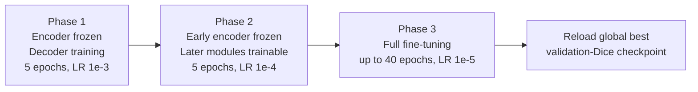

### Important freeze-code nuance

Phase 2 description says “last two encoder stages”, but actual implementation
freezes only parameter names starting with `enc0`, `enc1`, or `enc2`; everything
else becomes trainable. Therefore:

- Attention U-Net phase 2 keeps `enc1` and `enc2` frozen, while `enc3`,
  `enc4`, bottleneck, and decoder train.
- U-Net++ keeps `enc0`, `enc1`, `enc2` frozen, while `enc3`, `enc4`, and nested
  decoder train.
- TransUNet keeps `enc1` and `enc2` frozen; `enc3`, `enc4`, CNN bottleneck,
  Transformer, projections, and decoder train.

Actual trainable parameters:

| Model | Phase 1 | Phase 2 | Phase 3 |
|---|---:|---:|---:|
| Attention U-Net | 3,240,269 (13.2%) | 24,293,453 (99.1%) | 100% |
| U-Net++ | 4,870,913 (18.6%) | 24,807,681 (94.8%) | 100% |
| TransUNet | 3,148,353 (4.6%) | 67,567,169 (99.7%) | 100% |

---

# Shared Building Blocks

## 9. ConvBlock

Attention U-Net, U-Net++, and TransUNet decoder-e same `ConvBlock` use hoy:

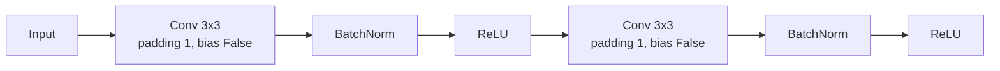

## 10. Attention Gate

Sudhu Attention U-Net-e use hoy:

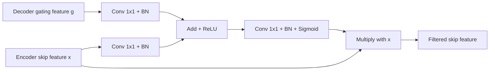

Gate decoder context use kore encoder skip-er relevant spatial region emphasize
kore and irrelevant background suppress kore.

---

# Model 1: Pretrained Attention U-Net

## 11. Architecture

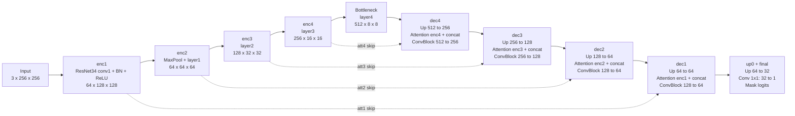

### Code facts

- Type: CNN-based U-Net with attention gates
- Encoder: ResNet34 ImageNet-1K V1
- Decoder: Four transposed-convolution stages
- Skip connections: Four attention-filtered skips
- Parameters: **24,524,941**
- Best validation Dice: **0.7618**
- Epochs run: **24**
- Test Dice: **0.7602**
- Test IoU: **0.6696**

### Why used?

- U-Net structure precise localization support kore.
- Attention gates lesion-relevant skip features select korte pare.
- Pretrained encoder small medical dataset-e transferable low-level features
  provide kore.

---

# Model 2: U-Net++

## 12. Architecture

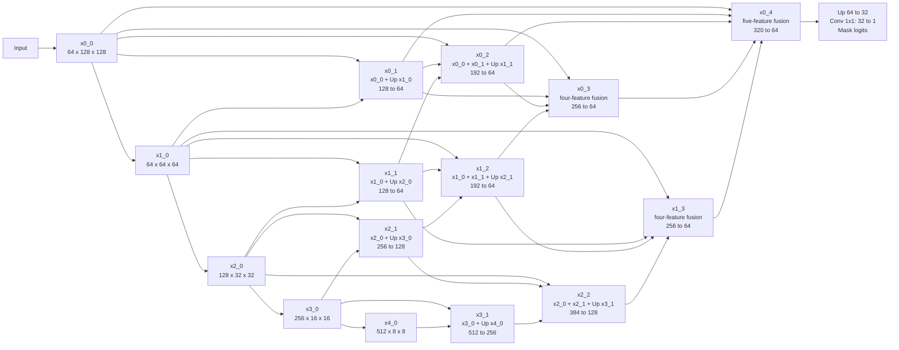

### Code facts

- Type: Nested CNN U-Net
- Encoder: ResNet34 ImageNet-1K V1
- Dense nested decoder nodes: `x0_1` through `x0_4`
- Deep supervision: **Not used**
- Final output source: Only `x0_4`
- Attention gates: **Not used**
- Parameters: **26,155,585**
- Best validation Dice: **0.7747**
- Epochs run: **49**
- Test Dice: **0.7933**
- Test IoU: **0.7035**

### Why used?

- Dense nested skips encoder-decoder semantic gap reduce korte pare.
- Multiple intermediate fusion paths fine boundary information preserve kore.
- Project-er highest test Dice and IoU ei model achieve kore.

---

# Model 3: TransUNet

## 13. Architecture

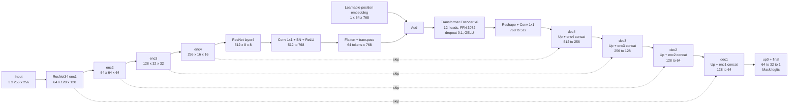

### Code facts

- Type: CNN-Transformer hybrid
- CNN encoder: ResNet34 ImageNet-1K V1
- Bottleneck tokens: 64
- Embedding dimension: 768
- Transformer layers: 6
- Attention heads: 12
- Feed-forward dimension: 3072
- Dropout: 0.1
- Activation: GELU
- Parameters: **67,798,657**
- Best validation Dice: **0.7705**
- Epochs run: **34**
- Test Dice: **0.7788**
- Test IoU: **0.6893**

### Why used?

- CNN local texture/edge features capture kore.
- Transformer bottleneck long-range spatial context model kore.
- CNN-only architectures-er against hybrid comparison provide kore.

---

# Model 4: Attention U-Net From Scratch

## 14. Architecture and Difference

Architecture pretrained Attention U-Net-er **exact same**:

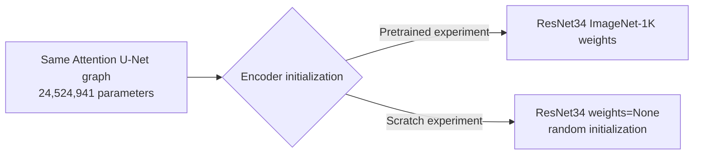

Scratch training:

- `AttentionUNet(..., pretrained=False)`
- All parameters trainable from epoch 1
- Single phase
- Maximum 50 epochs
- Learning rate `1e-3`
- AdamW, weight decay `1e-2`
- CosineAnnealingLR with `T_max=50`
- BCE-Dice loss
- Early stopping patience 10
- Epochs run: **41**
- Best validation Dice: **0.7319**
- Test Dice: **0.7459**
- Test IoU: **0.6571**

### Why this experiment?

Transfer learning-er actual benefit measure korar alternative experiment.
Architecture constant rekhe only initialization/training strategy change kora
hoyeche.

---

## 15. Pretrained vs Scratch Attention U-Net

| Metric | From scratch | Pretrained |
|---|---:|---:|
| Validation Dice | 0.7319 | **0.7618** |
| Test Dice | 0.7459 | **0.7602** |
| IoU | 0.6571 | **0.6696** |
| Pixel Accuracy | 0.9537 | **0.9595** |
| Sensitivity | 0.7726 | **0.7859** |
| Specificity | 0.9799 | **0.9816** |
| Hausdorff95 | **26.6026** | 28.6401 |

Pretrained model most overlap/pixel metrics-e better, but Hausdorff95-e scratch
lower and therefore better. So “pretrained every metric-e better” bola factual
hobe na.

---

# Ensemble and Post-processing

## 16. Segmentation Ensemble

Ensemble-e only three pretrained models participate:

- Attention U-Net
- U-Net++
- TransUNet

Scratch model ensemble-e included noy.

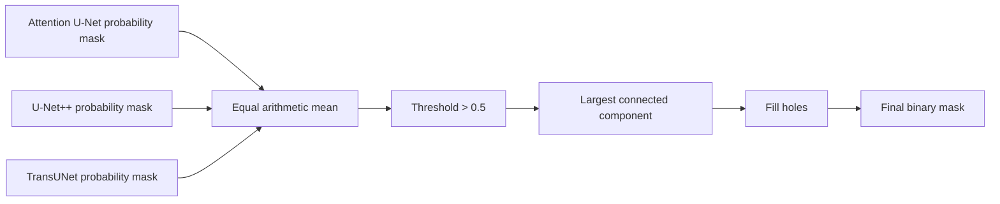

Classification ensemble-er moto validation-based weights ekhane use hoy na.
Three probability masks equal weight-e average hoy.

## 17. Post-processing

1. Connected components label kora hoy.
2. Multiple components hole largest component rakha hoy.
3. Small isolated predictions remove hoy.
4. Retained lesion region-er internal holes fill kora hoy.

Assumption: One dominant lesion region expected. Multiple real lesions thakle
largest-component rule valid secondary lesions remove korte pare.

---

## 18. Evaluation Metrics

- **Dice:** Predicted and ground-truth mask overlap; higher better.
- **IoU:** Intersection divided by union; higher better.
- **Pixel Accuracy:** Correct foreground and background pixels; higher better.
- **Sensitivity:** Actual tumor pixels correctly detected; higher better.
- **Specificity:** Background pixels correctly rejected; higher better.
- **Hausdorff95:** 95th-percentile boundary distance; lower better.

Metrics per image calculate kore tarpor mean neya hoy.

---

## 19. Test Results

| Metric | Attention U-Net | U-Net++ | TransUNet | Ensemble | Scratch A-UNet |
|---|---:|---:|---:|---:|---:|
| Dice | 0.7602 | **0.7933** | 0.7788 | 0.7770 | 0.7459 |
| IoU | 0.6696 | **0.7035** | 0.6893 | 0.6911 | 0.6571 |
| Pixel Accuracy | 0.9595 | **0.9644** | 0.9627 | 0.9631 | 0.9537 |
| Sensitivity | 0.7859 | **0.8128** | 0.7718 | 0.7837 | 0.7726 |
| Specificity | 0.9816 | 0.9838 | **0.9871** | 0.9852 | 0.9799 |
| Hausdorff95 | 28.6401 | **24.9965** | 26.0162 | 26.8179 | 26.6026 |

### Objective result

- Overall best segmentation model: **U-Net++**
- Highest Dice, IoU, pixel accuracy, and sensitivity: U-Net++
- Lowest/best Hausdorff95: U-Net++
- Highest specificity: TransUNet
- Ensemble best model noy; U-Net++ ensemble-er cheye better perform kore.

Validation Dice:

| Model | Validation Dice |
|---|---:|
| Attention U-Net | 0.7618 |
| U-Net++ | 0.7747 |
| TransUNet | 0.7705 |
| Ensemble | **0.7751** |
| Scratch Attention U-Net | 0.7319 |

Ensemble validation Dice slightly highest, but test-e U-Net++ best.

---

## 20. Bootstrap Confidence Intervals

Selected 95% confidence intervals:

| Model | Dice mean | 95% CI |
|---|---:|---|
| Attention U-Net | 0.7602 | 0.7026-0.8110 |
| U-Net++ | 0.7933 | 0.7415-0.8394 |
| TransUNet | 0.7788 | 0.7242-0.8272 |
| Ensemble | 0.7770 | 0.7193-0.8268 |
| Scratch Attention U-Net | 0.7459 | 0.6869-0.7975 |

Intervals overlap substantially; dataset/test sample small bole ranking-er
uncertainty acknowledge kora uchit.

---

# Presentation-Ready Points

## 21. Attention U-Net Pretrained

- CNN-based U-Net with attention gates
- ResNet34 ImageNet-1K pretrained encoder
- Four attention-filtered skip connections
- BCE + Dice loss
- Three-phase fine-tuning
- Parameters: 24.52M
- Best validation Dice: 0.7618
- Test Dice: 0.7602
- Why used: Attention-guided localization suppresses irrelevant skip features

## 22. U-Net++

- CNN-based nested U-Net
- ResNet34 ImageNet-1K pretrained encoder
- Dense nested skip pathways
- No deep supervision in this implementation
- Parameters: 26.16M
- Best validation Dice: 0.7747
- Test Dice: 0.7933
- Why used: Dense multi-scale feature fusion reduces encoder-decoder semantic gap

## 23. TransUNet

- Hybrid CNN + Transformer segmentation model
- Pretrained ResNet34 encoder
- Six-layer Transformer bottleneck
- 64 tokens, dimension 768, 12 attention heads
- Parameters: 67.80M
- Best validation Dice: 0.7705
- Test Dice: 0.7788
- Why used: Combines local CNN features with long-range global context

## 24. Attention U-Net Scratch

- Same architecture as pretrained Attention U-Net
- ResNet34 `weights=None`
- All parameters trained from start
- Single-phase training
- Parameters: 24.52M
- Best validation Dice: 0.7319
- Test Dice: 0.7459
- Why used: Controlled alternative experiment to quantify transfer-learning benefit

---

# Viva Questions

## 25. General Questions

### Why exclude normal images?

Normal images have no lesion to segment. They are filtered inside
`BUSISegmentationDataset`.

### Why merge multiple masks?

All annotated lesion regions preserve korte pixel-wise OR/maximum use kora hoy.

### Why BCE and Dice together?

BCE pixel-wise classification optimize kore; Dice foreground overlap and class
imbalance handle kore.

### Why raw logits output?

`BCEWithLogitsLoss` internally stable Sigmoid+BCE calculation kore. Inference-e
Sigmoid separately apply hoy.

### Why threshold 0.5?

Probability 0.5-er beshi hole pixel foreground dhora hoy. Eta configured fixed
decision threshold; threshold tuning notebook-e kora hoyni.

### Why pretrained ResNet34?

Small dataset-e pretrained edge, texture, and shape features useful starting
point provide kore.

### Why three-phase fine-tuning?

Prothome decoder adapt, pore later encoder/context modules adapt, finally low
learning rate-e full network refine kora.

### What is a skip connection?

Encoder-er higher-resolution spatial feature decoder-e directly pass kore,
localization detail recover korte help kore.

### Dice versus IoU?

Duita overlap metric. Dice overlap-ke `2 x intersection` diye weight kore;
IoU intersection/union measure kore.

### Why pixel accuracy misleading hote pare?

Background pixels beshi hole mostly-background prediction-o high pixel accuracy
pete pare. Tai Dice/IoU necessary.

### Hausdorff95 lower better keno?

Eta predicted and true boundary-r distance measure kore; smaller distance means
closer boundary agreement.

### Why post-processing?

Small isolated noise remove and lesion-er internal gaps fill korte.

### Post-processing limitation?

Largest-component filtering multiple genuine lesions-er smaller regions remove
korte pare.

### Why ensemble?

Different model probability masks combine kore architecture-specific error
reduce korar attempt.

### Did ensemble win?

No. Validation Dice slightly best chilo, but test-e U-Net++ best Dice and IoU
achieve kore.

---

## 26. Model-Specific Questions

### Attention Gate kibhabe kaj kore?

Decoder gating signal and encoder skip-ke separate `1x1 Conv + BN` diye common
intermediate dimension-e project kore, add-ReLU kore, `1x1 Conv + BN + Sigmoid`
attention map banay, then encoder feature-er sathe multiply kore.

### U-Net++ standard model-er shob feature use kora hoyeche?

No. Nested dense decoder use hoy, but deep supervision implement kora hoyni.
Only `x0_4` final output produce kore.

### TransUNet-e Transformer kothay?

ResNet34 `layer4`-er por `8 x 8` bottleneck feature map-e.

### TransUNet-e patch embedding ki separate image patch layer?

No. CNN bottleneck feature map `768 x 8 x 8` flatten kore 64 tokens banano hoy.

### Scratch model-er architecture ki different?

No. Same Attention U-Net class. Only ResNet34 initialization is random and all
parameters train from the beginning.

### Largest model konta?

TransUNet, approximately 67.80M parameters.

### Best model konta?

Test results অনুযায়ী U-Net++: Dice 0.7933 and IoU 0.7035.

---

## 27. Honest Limitations

1. Only 97 segmentation test images.
2. Single split used; K-fold configured line commented and not executed.
3. Normal images excluded, so segmentation evaluation conditional on abnormal
   images.
4. Fixed threshold 0.5 was not optimized.
5. Largest-component post-processing assumes one dominant lesion.
6. Ensemble uses equal weights; validation-based weighting was not tested.
7. Ensemble did not outperform U-Net++ on the test set.
8. Confidence intervals overlap considerably.
9. No external clinical dataset validation.
10. Pretrained versus scratch advantage is modest on test Dice, and scratch
    has better Hausdorff95 than pretrained Attention U-Net.

---

## 28. One-Minute Segmentation Explanation

“After classification, only benign or malignant images are sent to
segmentation. Multiple BUSI annotation masks were first merged using a
pixel-wise OR operation. The segmentation dataset excludes normal images and
contains 600 training, 97 validation, and 97 test images.

We evaluated three unique architectures: a pretrained Attention U-Net, a
pretrained U-Net++, and a pretrained TransUNet. We also trained the same
Attention U-Net architecture from scratch as an alternative experiment. All
models output one-channel mask logits and use a combined BCE-Dice loss. The
pretrained models were trained with encoder freezing, partial unfreezing, and
full fine-tuning. During inference, three pretrained probability masks were
averaged, thresholded at 0.5, and cleaned using largest-component selection and
hole filling.

U-Net++ achieved the best test performance with a Dice score of 0.7933 and IoU
of 0.7035. The ensemble achieved 0.7770 Dice, so it did not outperform the best
individual model. The pretrained Attention U-Net outperformed its scratch
version on Dice, IoU, sensitivity, and pixel accuracy, supporting transfer
learning for this small dataset.”

---

# Appendix: Final Verified Architecture Diagrams

The earlier model sections contain compact explanatory diagrams. The following
are the **full code-verified Mermaid diagrams finalized against the notebook**.

## A. Attention U-Net From Scratch

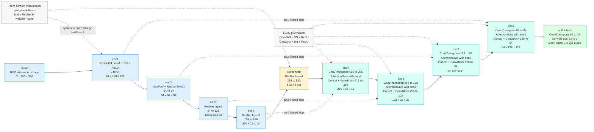

## B. Attention U-Net Pretrained

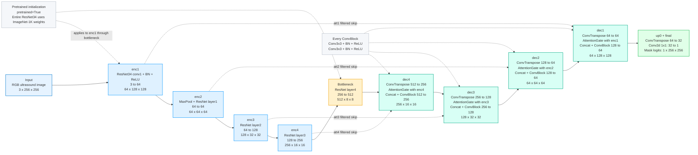

## C. U-Net++ Pretrained

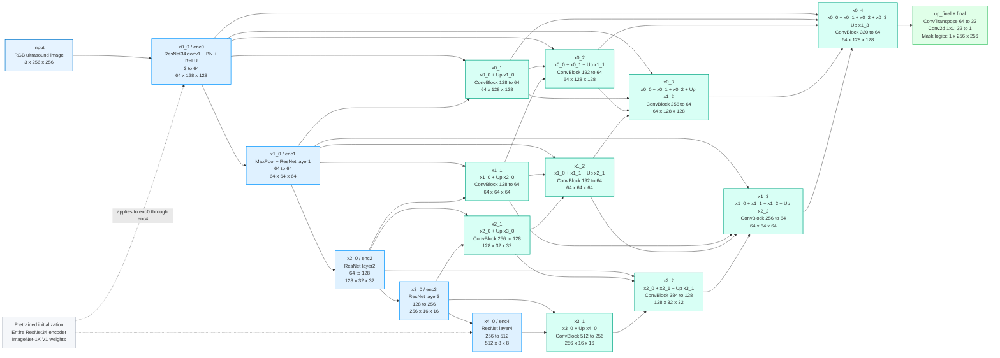

## D. TransUNet Pretrained

```mermaid
flowchart LR
    A["Input<br/>RGB ultrasound image<br/>3 x 256 x 256"]

    B["enc1<br/>ResNet34 conv1 + BN + ReLU<br/>3 to 64<br/>64 x 128 x 128"]

    C["enc2<br/>MaxPool + ResNet layer1<br/>64 to 64<br/>64 x 64 x 64"]

    D["enc3<br/>ResNet layer2<br/>64 to 128<br/>128 x 32 x 32"]

    E["enc4<br/>ResNet layer3<br/>128 to 256<br/>256 x 16 x 16"]

    F["bottleneck_cnn<br/>ResNet layer4<br/>256 to 512<br/>512 x 8 x 8"]

    G["bottleneck_proj<br/>Conv2d 1x1 + BN + ReLU<br/>512 to 768<br/>768 x 8 x 8"]

    H["Token conversion<br/>Flatten spatial dimensions + transpose<br/>64 tokens x 768"]

    PE["Learnable positional embedding<br/>Shape: 1 x 64 x 768<br/>Truncated-normal initialization"]

    T["Transformer Encoder x 6<br/>d_model 768, heads 12<br/>FFN dimension 3072<br/>Dropout 0.1, GELU<br/>batch_first=True"]

    I["Reshape + projection<br/>64 tokens to 768 x 8 x 8<br/>Conv2d 1x1: 768 to 512"]

    J["dec4<br/>ConvTranspose 512 to 256<br/>Concat with enc4: 256 + 256<br/>ConvBlock 512 to 256<br/>256 x 16 x 16"]

    K["dec3<br/>ConvTranspose 256 to 128<br/>Concat with enc3: 128 + 128<br/>ConvBlock 256 to 128<br/>128 x 32 x 32"]

    L["dec2<br/>ConvTranspose 128 to 64<br/>Concat with enc2: 64 + 64<br/>ConvBlock 128 to 64<br/>64 x 64 x 64"]

    M["dec1<br/>ConvTranspose 64 to 64<br/>Concat with enc1: 64 + 64<br/>ConvBlock 128 to 64<br/>64 x 128 x 128"]

    N["up0 + final<br/>ConvTranspose 64 to 32<br/>Conv2d 1x1: 32 to 1<br/>Mask logits: 1 x 256 x 256"]

    O["Pretrained initialization<br/>Entire ResNet34 encoder and layer4<br/>ImageNet-1K V1 weights"]

    CB["Every ConvBlock<br/>Conv3x3 + BN + ReLU<br/>Conv3x3 + BN + ReLU"]

    A --> B --> C --> D --> E --> F --> G --> H
    H --> ADD["Add positional embedding"]
    PE --> ADD
    ADD --> T --> I --> J --> K --> L --> M --> N

    O -. "applies to enc1 through bottleneck_cnn" .-> B
    O -.-> F

    E -. "skip connection" .-> J
    D -. "skip connection" .-> K
    C -. "skip connection" .-> L
    B -. "skip connection" .-> M

    CB -.-> J
    CB -.-> K
    CB -.-> L
    CB -.-> M

    classDef input fill:#e6f3ff,stroke:#0077cc,stroke-width:1.5px;
    classDef encoder fill:#dff1ff,stroke:#0095ff,stroke-width:1.5px;
    classDef bottleneck fill:#e9ddff,stroke:#8e44ad,stroke-width:1.5px;
    classDef decoder fill:#d8fff5,stroke:#00a884,stroke-width:1.5px;
    classDef output fill:#e0ffe8,stroke:#1ab84f,stroke-width:1.5px;
    classDef note fill:#f5f7fa,stroke:#9aa4b2,stroke-width:1px;

    class A input;
    class B,C,D,E encoder;
    class F,G,H,PE,ADD,T,I bottleneck;
    class J,K,L,M decoder;
    class N output;
    class O,CB note;
```
