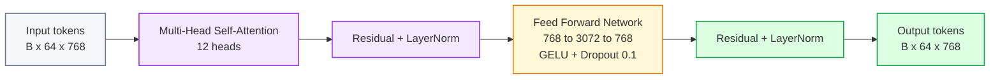

# TransUNet Pretrained Explanation

## Code Context

Amader notebook-e TransUNet manually define kora hoyeche `class TransUNet(nn.Module)` er moddhe.

Main structure:

```text
Pretrained ResNet34 CNN encoder
-> Transformer bottleneck
-> U-Net style decoder with skip connections
-> 1-channel segmentation mask logits
```

Encoder code:

```python
resnet = models.resnet34(weights=models.ResNet34_Weights.IMAGENET1K_V1)
```

So, encoder pretrained:

```text
ImageNet-1K V1 weights
```

Transformer configuration from code:

```text
embed_dim = 768
num_heads = 12
depth = 6
dim_feedforward = 768 * 4 = 3072
dropout = 0.1
activation = GELU
batch_first = True
```

Output:

```text
1 x 256 x 256 mask logits
```

---

## 1. Full TransUNet Architecture

```mermaid
flowchart LR
    A["Input<br/>RGB ultrasound image<br/>3 x 256 x 256"]

    B["enc1<br/>ResNet34 conv1 + BN + ReLU<br/>3 to 64<br/>64 x 128 x 128"]

    C["enc2<br/>MaxPool + ResNet layer1<br/>64 to 64<br/>64 x 64 x 64"]

    D["enc3<br/>ResNet layer2<br/>64 to 128<br/>128 x 32 x 32"]

    E["enc4<br/>ResNet layer3<br/>128 to 256<br/>256 x 16 x 16"]

    F["bottleneck_cnn<br/>ResNet layer4<br/>256 to 512<br/>512 x 8 x 8"]

    G["bottleneck_proj<br/>Conv2d 1x1 + BN + ReLU<br/>512 to 768<br/>768 x 8 x 8"]

    H["Token conversion<br/>Flatten spatial dimensions + transpose<br/>64 tokens x 768"]

    PE["Learnable positional embedding<br/>Shape: 1 x 64 x 768<br/>Truncated-normal initialization"]

    T["Transformer Encoder x 6<br/>d_model 768, heads 12<br/>FFN dimension 3072<br/>Dropout 0.1, GELU<br/>batch_first=True"]

    I["Reshape + projection<br/>64 tokens to 768 x 8 x 8<br/>Conv2d 1x1: 768 to 512"]

    J["dec4<br/>ConvTranspose 512 to 256<br/>Concat with enc4: 256 + 256<br/>ConvBlock 512 to 256<br/>256 x 16 x 16"]

    K["dec3<br/>ConvTranspose 256 to 128<br/>Concat with enc3: 128 + 128<br/>ConvBlock 256 to 128<br/>128 x 32 x 32"]

    L["dec2<br/>ConvTranspose 128 to 64<br/>Concat with enc2: 64 + 64<br/>ConvBlock 128 to 64<br/>64 x 64 x 64"]

    M["dec1<br/>ConvTranspose 64 to 64<br/>Concat with enc1: 64 + 64<br/>ConvBlock 128 to 64<br/>64 x 128 x 128"]

    N["up0 + final<br/>ConvTranspose 64 to 32<br/>Conv2d 1x1: 32 to 1<br/>Mask logits: 1 x 256 x 256"]

    O["Pretrained initialization<br/>Entire ResNet34 encoder and layer4<br/>ImageNet-1K V1 weights"]

    CB["Every ConvBlock<br/>Conv3x3 + BN + ReLU<br/>Conv3x3 + BN + ReLU"]

    A --> B --> C --> D --> E --> F --> G --> H
    H --> ADD["Add positional embedding"]
    PE --> ADD
    ADD --> T --> I --> J --> K --> L --> M --> N

    O -. "applies to enc1 through bottleneck_cnn" .-> B
    O -.-> F

    E -. "skip connection" .-> J
    D -. "skip connection" .-> K
    C -. "skip connection" .-> L
    B -. "skip connection" .-> M

    CB -.-> J
    CB -.-> K
    CB -.-> L
    CB -.-> M

    classDef input fill:#e6f3ff,stroke:#0077cc,stroke-width:1.5px;
    classDef encoder fill:#dff1ff,stroke:#0095ff,stroke-width:1.5px;
    classDef bottleneck fill:#e9ddff,stroke:#8e44ad,stroke-width:1.5px;
    classDef decoder fill:#d8fff5,stroke:#00a884,stroke-width:1.5px;
    classDef output fill:#e0ffe8,stroke:#1ab84f,stroke-width:1.5px;
    classDef note fill:#f5f7fa,stroke:#9aa4b2,stroke-width:1px;

    class A input;
    class B,C,D,E encoder;
    class F,G,H,PE,ADD,T,I bottleneck;
    class J,K,L,M decoder;
    class N output;
    class O,CB note;
```



Color meaning:

- Blue = ResNet34 CNN encoder
- Purple = Transformer bottleneck
- Green/teal = decoder
- Light green = output mask logits
- Gray = notes

---

## 2. Input

```text
Input
RGB ultrasound image
3 x 256 x 256
```

Model input holo RGB ultrasound image.

- `3` = RGB channel
- `256 x 256` = image height and width
- Segmentation model-e input hisebe only image jay
- Mask model input na, mask training-er target

Single image:

```text
3 x 256 x 256
```

Batch input:

```text
B x 3 x 256 x 256
```

Simple meaning:

**TransUNet ekta ultrasound image ney and corresponding tumour mask predict kore.**

---

## 3. Pretrained ResNet34 Encoder

Code:

```python
resnet = models.resnet34(weights=models.ResNet34_Weights.IMAGENET1K_V1)
```

So encoder pretrained.

Pretrained part:

```text
enc1
enc2
enc3
enc4
bottleneck_cnn
```

These all come from ResNet34.

Important:

Decoder and transformer bottleneck ImageNet pretrained na. ResNet34 encoder weights pretrained.

Presentation-safe line:

**The CNN encoder is initialized from ImageNet-1K pretrained ResNet34 weights, while the transformer bottleneck and decoder are trained for BUSI segmentation.**

---

## 4. enc1

```text
enc1
ResNet34 conv1 + BN + ReLU
3 to 64
64 x 128 x 128
```

Input:

```text
3 x 256 x 256
```

Output:

```text
64 x 128 x 128
```

Meaning:

- RGB image 64 feature map-e convert hoy
- stride 2 er jonno spatial size `256 to 128`
- low-level feature extract hoy: edge, texture, brightness pattern

---

## 5. enc2

```text
enc2
MaxPool + ResNet layer1
64 to 64
64 x 64 x 64
```

Input:

```text
64 x 128 x 128
```

Output:

```text
64 x 64 x 64
```

Meaning:

- MaxPool spatial size half kore
- ResNet layer1 feature refine kore
- channel same thake: `64 to 64`

---

## 6. enc3

```text
enc3
ResNet layer2
64 to 128
128 x 32 x 32
```

Input:

```text
64 x 64 x 64
```

Output:

```text
128 x 32 x 32
```

Meaning:

- spatial size `64 to 32`
- channel `64 to 128`
- deeper feature representation create hoy

---

## 7. enc4

```text
enc4
ResNet layer3
128 to 256
256 x 16 x 16
```

Input:

```text
128 x 32 x 32
```

Output:

```text
256 x 16 x 16
```

Meaning:

- spatial size `32 to 16`
- channel `128 to 256`
- higher-level tumour/tissue context feature capture hoy

---

## 8. bottleneck_cnn

```text
bottleneck_cnn
ResNet layer4
256 to 512
512 x 8 x 8
```

Input:

```text
256 x 16 x 16
```

Output:

```text
512 x 8 x 8
```

Meaning:

- ResNet encoder-er deepest CNN feature
- spatial representation most compressed
- semantic/context information highest

Simple meaning:

**Ei CNN bottleneck feature transformer-er age image-er compact high-level summary banay.**

---

## 9. bottleneck_proj

```text
bottleneck_proj
Conv2d 1x1 + BN + ReLU
512 to 768
768 x 8 x 8
```

Code:

```python
self.bottleneck_proj = nn.Sequential(
    nn.Conv2d(512, embed_dim, kernel_size=1),
    nn.BatchNorm2d(embed_dim),
    nn.ReLU(inplace=True),
)
```

Here:

```text
embed_dim = 768
```

Input:

```text
512 x 8 x 8
```

Output:

```text
768 x 8 x 8
```

Why:

Transformer encoder expects embedding dimension `768`.  
So CNN feature channel `512` ke `768` dimension-e project kora hoy.

Simple meaning:

**CNN feature-ke transformer-compatible embedding dimension-e convert kora hoy.**

---

## 10. Token Conversion

```text
Token conversion
Flatten spatial dimensions + transpose
64 tokens x 768
```

Code:

```python
B, C, H, W = bt.shape
bt = bt.flatten(2).transpose(1, 2)
```

Before:

```text
B x 768 x 8 x 8
```

Flatten spatial:

```text
8 x 8 = 64
```

After transpose:

```text
B x 64 x 768
```

Meaning:

- 64 tokens
- each token has 768 feature values

Simple meaning:

**8x8 CNN feature map-ke transformer token sequence-e convert kora hoy.**

---

## 11. Learnable Positional Embedding

```text
Learnable positional embedding
Shape: 1 x 64 x 768
Truncated-normal initialization
```

Code:

```python
self.pos_embed = nn.Parameter(torch.zeros(1, num_patches, embed_dim))
nn.init.trunc_normal_(self.pos_embed, std=0.02)
```

Here:

```text
num_patches = 64
embed_dim = 768
```

Why needed:

Transformer tokens-er order/spatial position naturally jane na.  
Positional embedding token-ke bole kon token feature map-er kon position theke ashe.

Simple meaning:

**Positional embedding transformer-ke spatial location information dey.**

---

## 12. Add Positional Embedding

Code:

```python
bt = bt + self.pos_embed
```

Input token:

```text
B x 64 x 768
```

Positional embedding:

```text
1 x 64 x 768
```

Output:

```text
B x 64 x 768
```

Simple meaning:

**Token feature-er sathe position information add hoy.**

---

## 13. Transformer Encoder

```text
Transformer Encoder x 6
d_model 768
heads 12
FFN dimension 3072
Dropout 0.1
GELU
batch_first=True
```

Code:

```python
encoder_layer = nn.TransformerEncoderLayer(
    d_model=embed_dim,
    nhead=num_heads,
    dim_feedforward=embed_dim * 4,
    dropout=0.1,
    activation="gelu",
    batch_first=True,
)
self.transformer = nn.TransformerEncoder(encoder_layer, num_layers=depth)
```

Here:

```text
embed_dim = 768
num_heads = 12
depth = 6
dim_feedforward = 3072
```

Transformer Encoder-er kaj:

- token-to-token global relationship learn kora
- CNN bottleneck-er local/semantic feature-er upor long-range context add kora
- 64 tokens-er moddhe relation model kora

Simple meaning:

**CNN local features dey, transformer bottleneck global context and long-range dependency learn kore.**

---

## 14. Transformer Encoder Layer Internal Flow

Simplified flow:



Note:

PyTorch `TransformerEncoderLayer` internally self-attention, feed-forward network, residual connection, normalization, and dropout use kore.

---

## 15. Reshape + Projection Back

```text
Reshape + projection
64 tokens to 768 x 8 x 8
Conv2d 1x1: 768 to 512
```

Code:

```python
bt = bt.transpose(1, 2).view(B, -1, H, W)
bt = self.proj(bt)
```

Before:

```text
B x 64 x 768
```

Reshape:

```text
B x 768 x 8 x 8
```

Projection:

```text
768 x 8 x 8 -> 512 x 8 x 8
```

Why:

Decoder starts from 512-channel bottleneck feature.  
So transformer output `768` channel theke `512` channel-e project kora hoy.

Simple meaning:

**Transformer token output-ke abar CNN feature map format-e convert kore decoder-e pathano hoy.**

---

## 16. Decoder Overview

Decoder-er common pattern:

```text
ConvTranspose
-> concatenate encoder skip feature
-> ConvBlock
```

ConvTranspose spatial size double kore.

Skip connection encoder-er high-resolution feature decoder-e add kore, so boundary/detail recover korte help kore.

ConvBlock feature refine kore.

---

## 17. dec4

```text
dec4
ConvTranspose 512 to 256
Concat with enc4: 256 + 256
ConvBlock 512 to 256
256 x 16 x 16
```

Input:

```text
512 x 8 x 8
```

Upsample:

```text
512 x 8 x 8 -> 256 x 16 x 16
```

Skip:

```text
enc4 = 256 x 16 x 16
```

Concat:

```text
256 + 256 = 512 channels
```

ConvBlock output:

```text
256 x 16 x 16
```

---

## 18. dec3

```text
dec3
ConvTranspose 256 to 128
Concat with enc3: 128 + 128
ConvBlock 256 to 128
128 x 32 x 32
```

Output:

```text
128 x 32 x 32
```

Simple meaning:

**Feature resolution barche, channel komche, encoder detail add hocche.**

---

## 19. dec2

```text
dec2
ConvTranspose 128 to 64
Concat with enc2: 64 + 64
ConvBlock 128 to 64
64 x 64 x 64
```

Output:

```text
64 x 64 x 64
```

---

## 20. dec1

```text
dec1
ConvTranspose 64 to 64
Concat with enc1: 64 + 64
ConvBlock 128 to 64
64 x 128 x 128
```

Output:

```text
64 x 128 x 128
```

---

## 21. Every ConvBlock

```text
Conv3x3 + BN + ReLU
Conv3x3 + BN + ReLU
```

Code-er `ConvBlock` same block use kore decoder stages-e.

Purpose:

- concatenated decoder + skip feature refine kora
- local boundary/detail improve kora
- segmentation feature clean kora

Simple meaning:

**Every decoder stage-e ConvBlock mixed features-ke refine kore.**

---

## 22. up0 + final

```text
up0 + final
ConvTranspose 64 to 32
Conv2d 1x1: 32 to 1
Mask logits: 1 x 256 x 256
```

Input:

```text
64 x 128 x 128
```

up0:

```text
64 x 128 x 128 -> 32 x 256 x 256
```

final:

```text
32 x 256 x 256 -> 1 x 256 x 256
```

Output holo mask logits.

Important:

Logits probability na. Later sigmoid + threshold diye binary mask create hoy.

Simple meaning:

**Final stage original image size-e per-pixel tumour/background score output kore.**

---

## 23. Why TransUNet?

TransUNet useful because eta CNN and Transformer combine kore.

CNN encoder:

- local texture
- edge
- boundary
- ultrasound pattern

Transformer bottleneck:

- global context
- long-range relation
- overall lesion/tissue structure

Decoder:

- pixel-level mask reconstruction
- skip connection diye detail recovery

Presentation-safe line:

**TransUNet combines a pretrained ResNet34 CNN encoder for local feature extraction with a transformer bottleneck for global context modeling, followed by a U-Net style decoder for pixel-level segmentation.**

---

## 24. Full Speaking Script

For TransUNet, amader code ImageNet-1K pretrained ResNet34 encoder use kore. Input holo 3-channel 256 by 256 ultrasound image. Encoder first image-ke gradually downsample kore: enc1 output 64 by 128 by 128, enc2 output 64 by 64 by 64, enc3 output 128 by 32 by 32, enc4 output 256 by 16 by 16, and bottleneck_cnn output 512 by 8 by 8. Then bottleneck projection 1x1 convolution diye 512 channel-ke 768 channel-e convert kore, because transformer embedding dimension 768. Ei 8 by 8 feature map flatten kore 64 token banano hoy, each token has 768 features. Learnable positional embedding add kora hoy, then 6-layer Transformer Encoder apply kora hoy with 12 heads, FFN dimension 3072, dropout 0.1, and GELU activation. Transformer global token relationship learn kore. Tarpor token output reshape kore abar 768 by 8 by 8 feature map banano hoy and 1x1 convolution diye 512 channel-e project kora hoy. Decoder side-e ConvTranspose diye feature map upsample hoy, and enc4, enc3, enc2, enc1 skip connections concatenate hoy. Each decoder stage ConvBlock diye refine hoy. Finally up0 and 1x1 final convolution output kore 1 by 256 by 256 mask logits for tumour segmentation.

---

## 25. Short Presentation Points

- TransUNet is a hybrid CNN-Transformer segmentation model.
- Encoder: ImageNet-1K pretrained ResNet34.
- Input: `3 x 256 x 256` RGB ultrasound image.
- CNN bottleneck output: `512 x 8 x 8`.
- `bottleneck_proj`: `512 to 768`.
- Token sequence: `64 tokens x 768`.
- Positional embedding: `1 x 64 x 768`.
- Transformer Encoder: 6 layers, 12 heads.
- FFN dimension: `3072`.
- Dropout: `0.1`.
- Activation: `GELU`.
- Projection back: `768 to 512`.
- Decoder uses ConvTranspose + skip connections + ConvBlock.
- Output: `1 x 256 x 256` mask logits.

