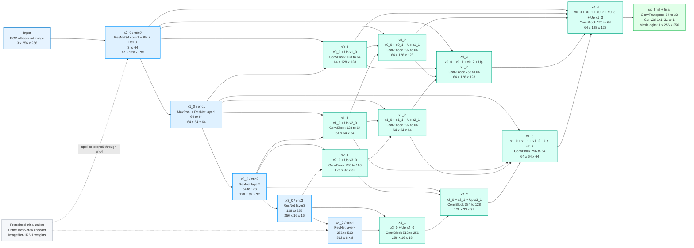

# U-Net++ Pretrained Explanation

## Code Context

Amader notebook-e U-Net++ manually define kora hoyeche `class UNetPlusPlus(nn.Module)` er moddhe.

Main structure:

```text
Pretrained ResNet34 encoder
-> nested dense decoder/fusion nodes
-> final upsampling
-> 1-channel segmentation mask logits
```

Encoder code:

```python
resnet = models.resnet34(weights=models.ResNet34_Weights.IMAGENET1K_V1)
```

So, encoder pretrained:

```text
ImageNet-1K V1 weights
```

Important:

Only ResNet34 encoder pretrained. Nested decoder nodes are newly defined and trained for BUSI segmentation.

---

## 1. Full U-Net++ Architecture



Color meaning:

- Blue = pretrained ResNet34 encoder
- Green/teal = U-Net++ nested decoder/fusion nodes
- Light green = final output mask logits
- Gray = pretrained initialization note

---

## 2. Input

```text
Input
RGB ultrasound image
3 x 256 x 256
```

Model input holo RGB ultrasound image.

- `3` = RGB channels
- `256 x 256` = image height and width
- Model input hisebe only image jay
- Mask training-er target, model input na

Single image:

```text
3 x 256 x 256
```

Batch input:

```text
B x 3 x 256 x 256
```

Simple meaning:

**U-Net++ image ney and corresponding tumour segmentation mask predict kore.**

---

## 3. Pretrained ResNet34 Encoder

Code:

```python
resnet = models.resnet34(weights=models.ResNet34_Weights.IMAGENET1K_V1)
```

Encoder levels:

```text
x0_0 / enc0
x1_0 / enc1
x2_0 / enc2
x3_0 / enc3
x4_0 / enc4
```

These all come from ResNet34.

Important:

```text
Only encoder is pretrained.
Nested decoder is not pretrained.
```

Presentation-safe line:

**U-Net++ uses an ImageNet-1K pretrained ResNet34 encoder, while the nested decoder/fusion blocks are trained for BUSI segmentation.**

---

## 4. Encoder Level Count

U-Net++ e encoder feature levels 5 ta:

```text
x0_0, x1_0, x2_0, x3_0, x4_0
```

`x4_0 / enc4` holo deepest encoder level. Eta bottleneck-er moto kaj kore.

Presentation-safe line:

**U-Net++ has five encoder feature levels, where the last level works as the deepest representation.**

---

## 5. x0_0 / enc0

```text
x0_0 / enc0
ResNet34 conv1 + BN + ReLU
3 to 64
64 x 128 x 128
```

Input:

```text
3 x 256 x 256
```

Output:

```text
64 x 128 x 128
```

Meaning:

- RGB image 64 feature map-e convert hoy
- spatial size `256 to 128`
- low-level edge/texture/brightness features extract hoy

---

## 6. x1_0 / enc1

```text
x1_0 / enc1
MaxPool + ResNet layer1
64 to 64
64 x 64 x 64
```

Input:

```text
64 x 128 x 128
```

Output:

```text
64 x 64 x 64
```

Meaning:

- MaxPool spatial size half kore
- ResNet layer1 feature refine kore
- channel same thake

---

## 7. x2_0 / enc2

```text
x2_0 / enc2
ResNet layer2
64 to 128
128 x 32 x 32
```

Input:

```text
64 x 64 x 64
```

Output:

```text
128 x 32 x 32
```

Meaning:

- spatial size `64 to 32`
- channel `64 to 128`
- deeper feature representation create hoy

---

## 8. x3_0 / enc3

```text
x3_0 / enc3
ResNet layer3
128 to 256
256 x 16 x 16
```

Input:

```text
128 x 32 x 32
```

Output:

```text
256 x 16 x 16
```

Meaning:

- spatial size `32 to 16`
- channel `128 to 256`
- higher-level tumour/tissue context capture hoy

---

## 9. x4_0 / enc4

```text
x4_0 / enc4
ResNet layer4
256 to 512
512 x 8 x 8
```

Input:

```text
256 x 16 x 16
```

Output:

```text
512 x 8 x 8
```

Meaning:

- deepest encoder feature
- most compressed representation
- high-level semantic/context information capture kore

---

## 10. U-Net++ Decoder Main Idea

Normal U-Net-e direct skip connection thake:

```text
encoder feature -> decoder feature
```

U-Net++ e direct skip-er majhe nested dense fusion nodes thake:

```text
x0_1, x0_2, x0_3, x0_4 ...
```

Decoder nodes total:

```text
4 + 3 + 2 + 1 = 10
```

Why nested decoder:

- encoder and decoder feature-er semantic gap komay
- skip connection gradually refine kore
- boundary/detail segmentation improve korte help kore

Presentation-safe line:

**U-Net++ mainly uses a nested dense decoder, where intermediate fusion nodes refine skip features before final mask prediction.**

---

## 11. Decoder Node Layout

Nested decoder nodes 4 column-e arranged:

```text
Column 1: x0_1, x1_1, x2_1, x3_1
Column 2: x0_2, x1_2, x2_2
Column 3: x0_3, x1_3
Column 4: x0_4
```

Total:

```text
4 + 3 + 2 + 1 = 10 nodes
```

Simple meaning:

**U-Net++ decoder simple straight decoder na; eta dense nested grid-er moto feature fusion kore.**

---

## 12. ConvBlock

Code-er ConvBlock:

```text
Conv3x3 + BN + ReLU
Conv3x3 + BN + ReLU
```

Purpose:

- concatenated feature refine kora
- local spatial pattern clean kora
- segmentation boundary/detail improve kora

Simple meaning:

**Every nested decoder node concatenated features-ke ConvBlock diye refine kore.**

---

## 13. Up Operation

Diagram-e `Up` means `ConvTranspose2d`.

Example:

```python
self.up0_1 = nn.ConvTranspose2d(f1, f0, 2, stride=2)
```

It does:

- spatial size double
- channel target level-e reduce

Example:

```text
64 x 64 x 64 -> 64 x 128 x 128
```

or

```text
128 x 32 x 32 -> 64 x 64 x 64
```

Simple meaning:

**Up operation deeper feature-ke higher resolution-e niye ashe, same-level feature-er sathe concat korar jonno.**

---

## 14. x0_1

```text
x0_1
x0_0 + Up x1_0
ConvBlock 128 to 64
64 x 128 x 128
```

Inputs:

```text
x0_0 = 64 x 128 x 128
x1_0 = 64 x 64 x 64
```

Up x1_0:

```text
64 x 64 x 64 -> 64 x 128 x 128
```

Concat:

```text
64 + 64 = 128 channels
```

ConvBlock:

```text
128 to 64
```

Output:

```text
64 x 128 x 128
```

---

## 15. x1_1

```text
x1_1
x1_0 + Up x2_0
ConvBlock 128 to 64
64 x 64 x 64
```

Inputs:

```text
x1_0 = 64 x 64 x 64
x2_0 = 128 x 32 x 32
```

Up x2_0:

```text
128 x 32 x 32 -> 64 x 64 x 64
```

Concat:

```text
64 + 64 = 128 channels
```

Output:

```text
64 x 64 x 64
```

---

## 16. x2_1

```text
x2_1
x2_0 + Up x3_0
ConvBlock 256 to 128
128 x 32 x 32
```

Inputs:

```text
x2_0 = 128 x 32 x 32
x3_0 = 256 x 16 x 16
```

Up x3_0:

```text
256 x 16 x 16 -> 128 x 32 x 32
```

Concat:

```text
128 + 128 = 256 channels
```

Output:

```text
128 x 32 x 32
```

---

## 17. x3_1

```text
x3_1
x3_0 + Up x4_0
ConvBlock 512 to 256
256 x 16 x 16
```

Inputs:

```text
x3_0 = 256 x 16 x 16
x4_0 = 512 x 8 x 8
```

Up x4_0:

```text
512 x 8 x 8 -> 256 x 16 x 16
```

Concat:

```text
256 + 256 = 512 channels
```

Output:

```text
256 x 16 x 16
```

---

## 18. x0_2

```text
x0_2
x0_0 + x0_1 + Up x1_1
ConvBlock 192 to 64
64 x 128 x 128
```

Concat:

```text
64 + 64 + 64 = 192 channels
```

Output:

```text
64 x 128 x 128
```

Simple meaning:

**x0_2 shallow original feature, previous decoder feature, and deeper refined feature combine kore.**

---

## 19. x1_2

```text
x1_2
x1_0 + x1_1 + Up x2_1
ConvBlock 192 to 64
64 x 64 x 64
```

Concat:

```text
64 + 64 + 64 = 192 channels
```

Output:

```text
64 x 64 x 64
```

---

## 20. x2_2

```text
x2_2
x2_0 + x2_1 + Up x3_1
ConvBlock 384 to 128
128 x 32 x 32
```

Concat:

```text
128 + 128 + 128 = 384 channels
```

Output:

```text
128 x 32 x 32
```

---

## 21. x0_3

```text
x0_3
x0_0 + x0_1 + x0_2 + Up x1_2
ConvBlock 256 to 64
64 x 128 x 128
```

Concat:

```text
64 + 64 + 64 + 64 = 256 channels
```

Output:

```text
64 x 128 x 128
```

---

## 22. x1_3

```text
x1_3
x1_0 + x1_1 + x1_2 + Up x2_2
ConvBlock 256 to 64
64 x 64 x 64
```

Concat:

```text
64 + 64 + 64 + 64 = 256 channels
```

Output:

```text
64 x 64 x 64
```

---

## 23. x0_4

```text
x0_4
x0_0 + x0_1 + x0_2 + x0_3 + Up x1_3
ConvBlock 320 to 64
64 x 128 x 128
```

Concat:

```text
64 + 64 + 64 + 64 + 64 = 320 channels
```

Output:

```text
64 x 128 x 128
```

This is final nested decoder feature used for output.

Simple meaning:

**x0_4 shob refined high-resolution decoder information combine kore final segmentation feature banay.**

---

## 24. up_final + final

```text
up_final + final
ConvTranspose 64 to 32
Conv2d 1x1: 32 to 1
Mask logits: 1 x 256 x 256
```

Input:

```text
64 x 128 x 128
```

up_final:

```text
64 x 128 x 128 -> 32 x 256 x 256
```

final:

```text
32 x 256 x 256 -> 1 x 256 x 256
```

Output holo mask logits.

Important:

Logits probability na. Later sigmoid + threshold diye binary mask create hoy.

Simple meaning:

**Final layer original image size-e per-pixel tumour/background score output kore.**

---

## 25. Why U-Net++?

U-Net++ useful karon eta normal U-Net-er direct skip connection refine kore nested dense skip pathway diye.

Benefits:

- encoder-decoder semantic gap komay
- multi-level feature fusion kore
- high-resolution detail preserve korte help kore
- tumour boundary segmentation-e useful

Presentation-safe line:

**U-Net++ improves standard U-Net by replacing direct skip connections with nested dense fusion nodes, which refine encoder features before final mask prediction.**

---

## 26. Full Speaking Script

For U-Net++, amader code ImageNet-1K pretrained ResNet34 encoder use kore. Input holo 3-channel 256 by 256 ultrasound image. Encoder-e five feature levels ache: x0_0, x1_0, x2_0, x3_0, and x4_0. These produce feature maps from 64 by 128 by 128 down to 512 by 8 by 8. U-Net++ er main difference holo nested dense decoder. Normal U-Net direct skip connection use kore, but U-Net++ multiple intermediate fusion nodes use kore. Amader decoder-e total 10 nested decoder nodes ache: first column-e 4, second column-e 3, third column-e 2, and final column-e 1. Each node concatenates same-level previous features with upsampled deeper features, then applies ConvBlock. ConvBlock uses two Conv3x3-BN-ReLU sequences. Finally, x0_4 theke up_final ConvTranspose spatial size 256 by 256 kore and final 1x1 convolution 1-channel mask logits output kore. This nested design helps refine skip features and reduce the semantic gap between encoder and decoder features.

---

## 27. Short Presentation Points

- U-Net++ is a CNN-based segmentation model.
- Encoder: ImageNet-1K pretrained ResNet34.
- Input: `3 x 256 x 256` RGB ultrasound image.
- Encoder feature levels: 5.
- Deepest encoder feature: `512 x 8 x 8`.
- Decoder: nested dense decoder/fusion grid.
- Decoder nodes: `4 + 3 + 2 + 1 = 10`.
- Each decoder node: concatenate features + ConvBlock.
- ConvBlock: `Conv3x3 + BN + ReLU`, repeated twice.
- Final output: `1 x 256 x 256` mask logits.
- Main benefit: refined skip connections and reduced encoder-decoder semantic gap.

